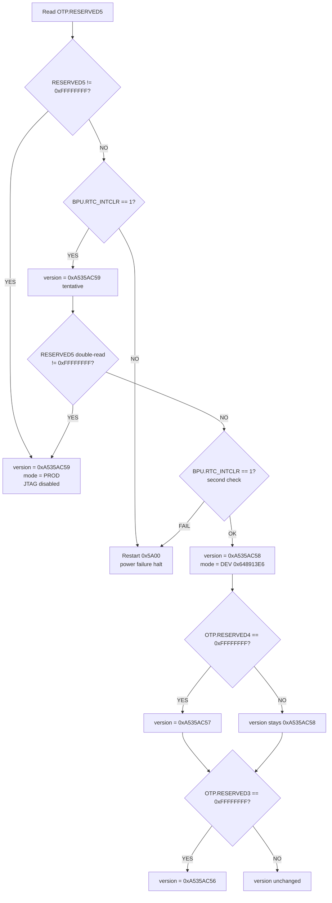
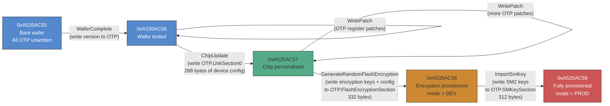
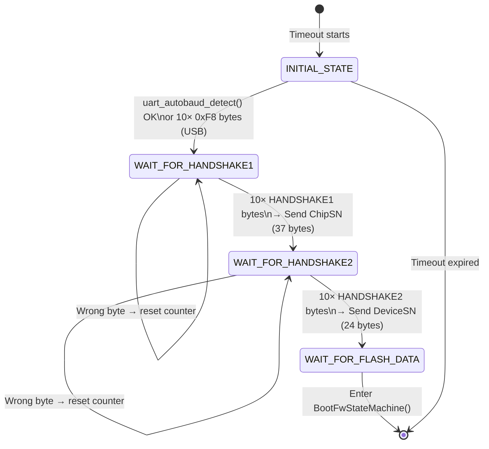
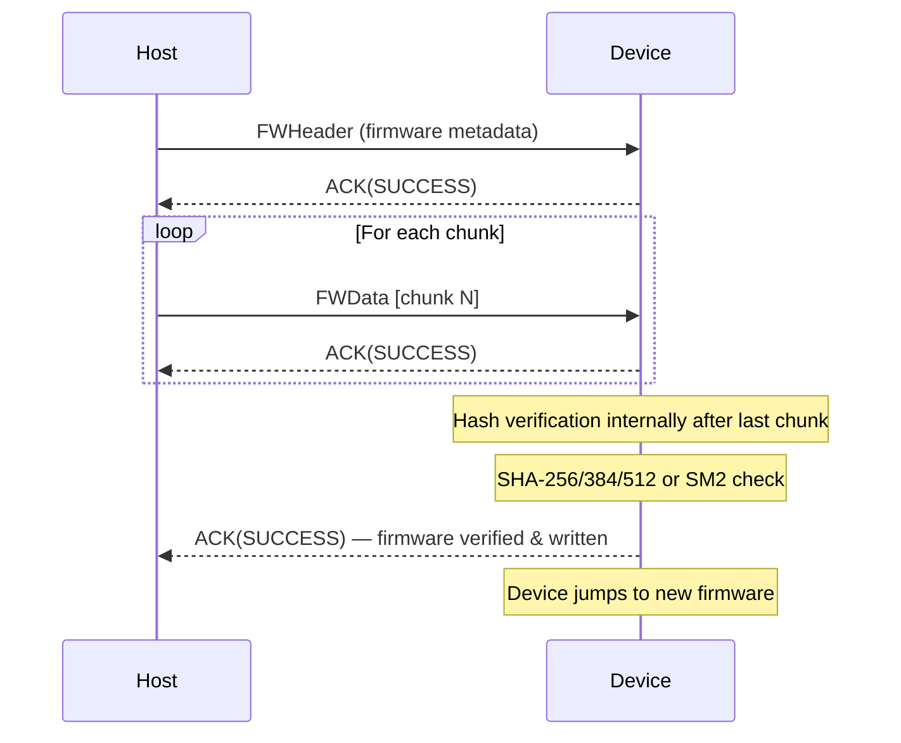
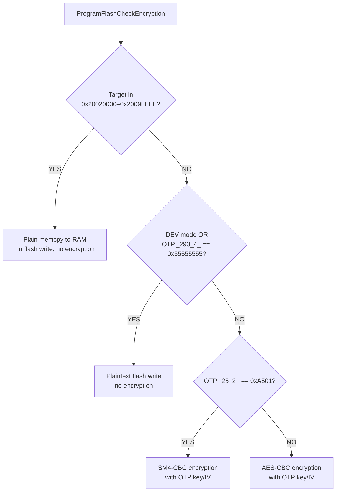
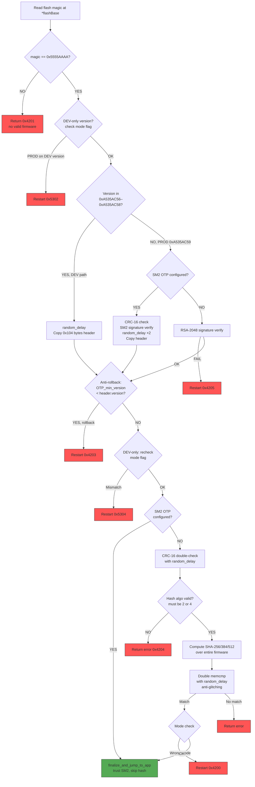

# Reverse Engineering the AIR105 Bootrom: A Deep Dive into the MH1903S Boot Process

The AIR105 is a secure microcontroller built around the MH1903S core --- an ARM Cortex-M4F processor running at 168 MHz, designed for payment terminals and other security-critical embedded applications. It features hardware cryptography (SM2/SM3/SM4, AES, RSA-2048, SHA-256/384/512), OTP (One-Time Programmable) memory for key storage --- though as we'll see, the bootrom can write to OTP regions via the UART protocol, so it's better thought of as controlled-access storage rather than truly write-once --- on-the-fly flash encryption via a cache encryption engine, and a battery-backed key processing unit (BPU).

This article documents the complete boot process of its immutable bootrom, reverse engineered from the raw binary using Ghidra. We'll trace the execution path from the reset vector all the way through to launching user firmware, covering the security lifecycle, the UART download protocol, firmware validation, and the differences between development and production devices.

---

## The Bootrom

The bootrom is approximately 200 KB of Thumb-2 code mapped at address `0x00000000`. It is factory-masked and cannot be modified. On reset, the Cortex-M processor reads the vector table from this address:

| Offset | Value | Purpose |
|--------|-------|---------|
| `0x00` | `0x200D0120` | Initial stack pointer |
| `0x04` | `0x00000329` | Reset handler (Thumb bit set) |
| `0x08` | `0x0000021D` | NMI handler |
| `0x0C` | `0x0000021D` | HardFault handler |

The reset vector points to `0x00000328`, the entry point into the bootrom's main logic.

---

## Phase 1: Reset Vector and Early Startup

### ResetHandler (0x00000328)

The reset handler is minimal:

```c
void ResetHandler(void) {
    NVIC.SCB.VTOR = 0x0;     // Vector table offset = 0 (bootrom)
    _start();                 // Never returns
}
```

It sets the Vector Table Offset Register to point at the bootrom's own vector table (address 0x0) and immediately calls `_start`.

### _start (0x000000FC)

The `_start` function performs the standard C runtime initialization: it sets the stack pointer, zeroes the `.bss` section, copies initialized data from flash to RAM, and then calls `_start2`.

### _start2 (0x0000277C)

This function walks a constructor table --- an array of `{function_ptr, arg0, arg1, arg2}` entries located between `0x0001FA88` and the end of the table. Each entry's function is called in order, performing static initializations before the main boot logic begins:

```c
void _start2(void) {
    for (ptr = &ctorTable_start; ptr < &ctorTable_end; ptr++) {
        (*ptr->function)(ptr->arg0, ptr->arg1, ptr->arg2);
    }
    bootMain();    // Never returns
}
```

After all constructors run, control passes to `bootMain` --- the heart of the bootrom.

---

## Phase 2: bootMain --- The Orchestrator

### bootMain (0x00012944)

The real `bootMain` (not to be confused with the thin trampoline at `0x00000104`) orchestrates the entire boot sequence:

```c
void bootMain(void) {
    // 1. Enable FPU
    NVIC.SCB.CPACR |= 0xF00000;

    // 2. Phase marker and hardware init
    FUN_0001d404(0);
    InitializeHardware();
    ConfigureQSPIFlash(0);
    init_boot_marker();
    FUN_0001d404(1);

    // 3. Determine security state from OTP
    uVar2 = get_boot_state();

    // 4. Attempt UART/USB download (with timeout)
    HandshakeStateMachine(uVar2);

    // 5. Try booting from internal flash
    uVar3 = TryBoot(uVar2, &MH_FLASH_BASE);
    DAT_20020118 = uVar3 | 0x55550000;

    // 6. Try booting from external flash (XIP region)
    uVar2 = TryBoot(uVar2, &DAT_20020000);
    DAT_2002011c = uVar2 | 0x66660000;

    // 7. Nothing worked --- increment boot counter and restart
    SYSCTRL_BASE.RSVD_POR |= 0x55;
    Restart(bootCounter << 1, 0);   // Never returns
}
```

The boot strategy is straightforward:

1. **Initialize hardware** --- clocks, UART, QSPI flash, TRNG.
2. **Read security configuration** from OTP memory.
3. **Listen for a download command** over UART/USB for a limited time window.
4. **Try to boot from internal flash** (built-in QSPI).
5. **Try to boot from external flash** (memory-mapped XIP region at `0x20020000`).
6. **Restart** if neither flash source contains valid firmware.

The `Restart()` function is the bootrom's universal error handler. It increments a boot-attempt counter in the `SYSCTRL_BASE.RSVD_POR` register, waits a configurable delay, then triggers a soft reset via `SYSCTRL_BASE.SOFT_RST2 = 0x80000000`. On production devices, it also disables JTAG (`TST_BASE.TST_ROM = 0`).

---

## Phase 3: Hardware Initialization

### InitializeHardware (0x00002C28)

```c
void InitializeHardware(void) {
    ConfigureCaches();                              // Enable I/D caches
    SYSCTRL_PLLConfig(SYSCTRL_PLL_168MHz);          // Set PLL to 168 MHz
    SYSCTRL_PLLDivConfig(1);                        // PLL divider
    SYSCTRL_HCLKConfig(0);                          // AHB divider = 1 (168 MHz)
    SYSCTRL_PCLKConfig(1);                          // APB divider = 2 (84 MHz)
    SYSCTRL_APBPeriphClockCmd(0xa4300001, ENABLE);  // Enable APB peripherals
    SYSCTRL_APBPeriphResetCmd(0xa4300001, 1);       // Reset them
    SYSCTRL_APBPeriphClockCmd(0x30000001, ENABLE);  // Enable AHB peripherals
    SYSCTRL_AHBPeriphResetCmd(0x30000001, ENABLE);  // Reset them
    SYSCTRL_AHBPeriphResetCmd(0x10000000, DISABLE); // Release crypto from reset
    ConfigurePortC();                               // GPIO port C setup
    EnableUART3();                                  // Secondary UART
    TRNG_Start(TRNG0);                              // Start True Random Number Generator
    EnableUSBIRQ();                                 // USB interrupts
    ConfigureUART0(115200, 0);                      // Primary UART at 115200 baud
    ConfigureInterrupts();                          // NVIC setup
}
```

The system comes up at 168 MHz with all cryptographic hardware enabled and the TRNG already seeded. UART0 is configured at 115200 baud --- this is the primary interface for firmware download.

---

## Phase 4: Security State Determination

Before doing anything security-sensitive, the bootrom must determine what kind of device it's running on. This is controlled by OTP memory values. Despite the "One-Time Programmable" name, the bootrom provides commands to write to OTP through the UART download protocol (via `WriteFlashOption`, `ImportSmKey`, `WritePatch`, etc.), with an unlock mechanism (`InitializeOTPUnlockKeys`) that gates access. So OTP here is more accurately "controlled-access storage" --- writable under specific conditions, but not freely modifiable by arbitrary code.

### get_boot_state (0x00005048)

```c
uint get_boot_state(void) {
    __aeabi_memclr(&encryptKey, 32);        // Clear encryption key
    apply_otp_register_patches(0);           // Apply OTP register overrides
    ConfigureInterrupts();

    version = determine_boot_version();      // Read OTP regions
    minOTPVersion = get_min_otp_version();   // Anti-rollback threshold
    validate_otp_and_configure(version);     // Load crypto config
    downloadTimeout = get_download_timeout();

    // Apply SRAM-based OTP lock overrides
    if (*MH_SRAM_BASE != 0xFFFFFFFF) {
        MH_OTP_BASE.RO  |= *MH_SRAM_BASE;
        MH_OTP_BASE.ROL |= *MH_SRAM_BASE;
    }
    return version;
}
```

### determine_boot_version (0x000071D0)

This function reads OTP regions to establish the device's security lifecycle stage. It produces two critical values:

- **`version`** --- a numeric stage identifier ranging from `0xA535AC55` to `0xA535AC59`
- **`UINT_20000004`** --- the security mode flag: `0x648913E6` (DEV) or `0xAC371D01` (PROD)

The decision tree is:



In plain English: the OTP regions form a progression from development to production. As OTP fields are written during manufacturing (via the UART protocol's `WriteFlashOption`, `WritePatch`, `ChipUpdate`, and `ImportSmKey` commands), the device moves from development (open, permissive) to production (locked down, signature-enforced). Once `OTP.RESERVED5` is programmed, the device enters PROD mode with JTAG disabled. Unlike traditional fuse-based OTP, these regions can be written by the bootrom under controlled conditions --- the write operations are gated by the protocol state machine and version checks, not by hardware immutability.

### validate_otp_and_configure (0x000050D0)

Once the version is known, this function validates OTP content integrity and configures the security hardware:

1. **CRC-verify OTP sections** --- If the CRC of `OTP.UnkSection0` fails, the version is downgraded to `0xA535AC57`. If the CRC of `OTP.FlashEncryptionSection` fails, it's downgraded to `0xA535AC58`.

2. **Load flash encryption key** --- For version `0xA535AC59` (PROD):
   ```c
   memcpy(&encryptKey, OTP.FlashEncryptionSection + 0x129, 32);
   ```
   If `OTP._293_4_ == 0x55555555` (unprogrammed), cache encryption is disabled. Otherwise, the cache encryption engine is configured with the key from OTP for on-the-fly flash decryption.

3. **Run crypto self-tests** --- Via `MaybeValidateSignature()`, which tests SM2, SM3, SM4, AES, SHA-256, TRNG, and RSA based on a bitmask from OTP. If any test fails, the device halts with `Restart(0x5A03)`.

4. **Boot counter check** --- On non-DEV devices, verifies that the boot attempt counter hasn't exceeded a threshold (10 attempts). If it has, the device locks itself via the BPU.

5. **Integrity marker verification** --- Double-checks a marker with `random_delay()` calls between checks (anti-glitching measure).

The function returns the finalized version number, which then flows into the handshake and boot attempts.

---

## The Manufacturing Provisioning Flow

The version numbers (`0xA535AC55` through `0xA535AC59`) aren't just passive labels --- they represent discrete stages in a factory provisioning pipeline. Each stage is advanced by sending specific commands over the UART protocol, and each command writes data to OTP memory before bumping the version. The `uint32_t_ARRAY_200001ac` array in RAM tracks the current version and a monotonically increasing step counter that increments with every successful manufacturing operation.

The bootrom implements a complete wafer-to-product programming sequence, all driven through the same UART protocol used for firmware download.

### OTP Write Mechanism

All OTP writes go through `WriteOTPData()` at `0x0000D378`, which:

1. Verifies the target OTP region is unwritten (all `0xFF`)
2. Calls `OTP_UnProtect()` for each word address (unlocks the write protection)
3. Writes one 32-bit word at a time via `OTP_WriteWord()`

The unlock keys are trivial fixed constants set by `InitializeOTPUnlockKeys()` at `0x00007B94`:

```c
void InitializeOTPUnlocKKeys(void) {
    gu32OTP_Key1 = 0xABCD00A5;
    gu32OTP_Key2 = 0x1234005A;
}
```

This function is called during the handshake (after `WAIT_FOR_HANDSHAKE2`), but only if `version < 0xA535AC59` --- meaning the unlock is available on DEV devices but not on fully-provisioned PROD devices. The "unlock" is really just setting two well-known constants in RAM; there is no challenge-response or authentication.

### The Factory Pipeline



Each step is gated by the current version --- you can't skip ahead. Here's what each command does:

#### WaferComplete (`param_1 == 0xA535AC55`)

The first manufacturing step. Checks that the current version is exactly `0xA535AC55` (by verifying `param_1 == -0x5ACA53AA`), then writes the target version value (`0xA535AC56`) as a 4-byte word to the next free OTP slot. This is essentially a "wafer test passed" marker.

The underlying function `FUN_0000AE58` is the generic version-advancer: it checks that the target OTP word is still `0xFFFFFFFF` (unwritten), writes the new version number, and returns. If the OTP word is already written, it returns an error --- preventing double-advancement.

#### WritePatch (versions `0xA535AC56` -- `0xA535AC58`)

Writes patch records to OTP. A patch record is a variable-length block starting with a `0x5555AAAA` magic, followed by a count and CRC-verified data. The function `FUN_00007130` walks the OTP region looking for the next free slot (scanning for `0xFFFFFFFF`), respecting existing records that start with `0x5555AAAA`.

Patches can be applied at multiple stages and are used to override system register values via `apply_otp_register_patches()`. The `param_4` flag (0 = forward, 1 = backward via `BackPatch` command) selects between two OTP banks.

#### ChipUpdate (version `0xA535AC57`)

Available only when `param_1 == 0xA535AC57`. Writes 288 bytes of device-specific configuration to `OTP.UnkSection0`:

```c
// Header: fixed magic
otpData[0..3] = {0xAA, 0xAA, 0x55, 0x55};
// Copy 288 bytes from host
memcpy(otpData + 4, buffer, 288);
// Append CRC-16
otpData[292..295] = CRC16(otpData[0..291]);
// Write to OTP
WriteOTPData(OTP.UnkSection0, otpData, 296);
// Advance version to 0xA535AC57
```

This is the "chip personalization" step --- the host provides device-unique data that gets baked into OTP. The 24 bytes at `OTP.UnkSection0 + 4` are later sent as part of the ChipSN during the handshake, and bytes at offset 20-21 configure the download timeout.

On success, the version is advanced to `0xA535AC57`.

#### GenerateRandomFlashEncryption (version `0xA535AC58`)

The most complex provisioning step. Available when `param_1 == 0xA535AC58`. It writes the flash encryption configuration to `OTP.FlashEncryptionSection`:

```c
// Fixed magic header
otpData[0..3] = {0xAA, 0xAA, 0x55, 0x55};
// Copy host-provided config (288 or 324 bytes)
memcpy(otpData + 4, buffer, size);

// Auto-generate encryption key and IV from TRNG
// (unless host provides them with 0xAAAA flag)
if (otpData._292_4_ & 0xFFFF != 0xAAAA) {
    generate_random_bytes(otpData + 0x128, 16);  // encryptKey
    generate_random_bytes(otpData + 0x138, 16);  // encryptIV
}

// Set plaintext-write flag based on host config
if (otpData._292_4_ >> 16 == 0x5555) {
    otpData[0x124..0x127] = {0x55, 0x55, 0x55, 0x55};  // plaintext allowed
} else {
    otpData[0x124..0x127] = {0x00, 0x00, 0x00, 0x00};  // encryption required
}

// Load key into cache encryption engine
memcpy(&encryptKey, otpData + 0x128, 32);
ConfigureCache(&encryptKey, &encryptIV, otpData._24_4_ & 1);

// CRC and write
otpData[328..331] = CRC16(otpData[0..327]);
WriteOTPData(OTP.FlashEncryptionSection + 1, otpData, 332);

// Advance version to 0xA535AC58
```

This is where the device's flash encryption identity is created. The encryption key (16 bytes for SM4 or 32 bytes for AES) is either provided by the host or **generated randomly by the TRNG on-chip**. Once written, this key is used for on-the-fly flash decryption via the cache encryption engine. The key never leaves the device in the random generation path.

Critically, if `otpData._292_4_ == 0x55555555` (all default), cache encryption is disabled entirely and flash is stored in plaintext. This is the "no encryption" configuration.

On success, the version advances to `0xA535AC58` and `UINT_20000004` remains `0x648913E6` (DEV mode).

#### ImportSmKey (version >= `0xA535AC58`)

Writes 312 bytes of SM2 cryptographic keys to `OTP.SMKeySection`:

```c
memcpy(smKeyData, buffer, 312);
smKeyData[312..315] = CRC16(smKeyData[0..311]);
WriteOTPData(OTP.SMKeySection, smKeyData, 316);
```

This is gated by `param_1 >= 0xA535AC58` --- it can only be written after the flash encryption config is in place. The SM2 keys are used for device authentication and firmware signature verification in the SM2 path.

#### The Final Transition to PROD

After all OTP sections are written, the final step is to write `OTP.RESERVED5` with a value other than `0xFFFFFFFF`. This happens through the `GenerateRandomFlashEncryption` function's second call path or through the `ChipUpdate` flow at version `0xA535AC59`. Once `RESERVED5` is written, `determine_boot_version` detects it on the next boot, sets `UINT_20000004 = 0xAC371D01` (PROD), disables JTAG, and the device is permanently in production mode.

### Auxiliary Commands

| Command | Version Gate | OTP Target | Size | Purpose |
|---------|-------------|------------|------|---------|
| `WriteFlashOption` | Any (DEV) | `OTP.RESERVED7` or `OTP.RESERVED8` | 40 bytes + CRC | Flash configuration (QSPI parameters, timing). Writes to first available slot. |
| `WriteUSBTimeout` | Any (DEV) | `OTP.USBTimeoutData` | 12 bytes | Download timeout configuration |
| `WritePatch` / `BackPatch` | `0xA535AC56` -- `0xA535AC58` | OTP patch area (forward or backward bank) | Variable, 16-byte aligned | Register override patches |
| `CryptoCheck` | Any | None (read-only) | 2 bytes (bitmask) | Run crypto self-tests on demand |

### What This Means for Security

The entire provisioning flow is accessible over UART with no authentication beyond the version gates. The unlock keys are fixed constants (`0xABCD00A5`, `0x1234005A`). On a device that hasn't been fully provisioned (version < `0xA535AC59`), anyone with UART access can:

- Read the device serial numbers (ChipSN, DeviceSN) from the handshake
- Write arbitrary OTP data (flash config, encryption keys, SM2 keys)
- Control the encryption configuration (including choosing no encryption)
- Provision their own SM2 keys, effectively making themselves the firmware signing authority

The only thing protecting a partially-provisioned device is that the version must advance sequentially --- you can't skip from `0xA535AC55` directly to `0xA535AC59`. But you *can* advance through all stages yourself, providing your own keys at each step.

---

## The Security Lifecycle

Before continuing, it's worth summarizing the five lifecycle stages:

| Version | Mode | OTP State | Download Allowed | Signature Required | Flash Encryption |
|---------|------|-----------|-----------------|-------------------|-----------------|
| `0xA535AC55` | DEV | All unwritten | Yes (UART/USB) | No | No |
| `0xA535AC56` | DEV | R5-R3 unwritten | Yes (UART/USB) | No | No |
| `0xA535AC57` | DEV | R5-R4 unwritten | Yes (UART/USB) | No | No |
| `0xA535AC58` | DEV | R5 unwritten | Yes (UART/USB) | RSA or plain | Optional |
| `0xA535AC59` | PROD | R5 written | Yes (UART/USB) | RSA-2048 or SM2 | Yes (SM4/AES) |

The key insight is that **download mode is always available** --- even on production devices, the UART/USB handshake protocol is accessible. What changes is what the bootrom requires to accept new firmware: in DEV mode, a simple CRC-16 suffices; in PROD mode, a valid RSA-2048 or SM2 signature from the manufacturer is mandatory.

---

## Phase 5: The UART Handshake Protocol

### HandshakeStateMachine (0x00006874)

After hardware init and security configuration, `bootMain` calls `HandshakeStateMachine(version)`. This function opens a limited-time window during which an external tool can connect and initiate a firmware download. The state machine has four states:



#### State: INITIAL

The bootrom listens for connection on either UART or USB:

- **UART path**: Calls `uart_autobaud_detect(10)` which measures the timing of incoming bytes to auto-detect the baud rate. Once a valid byte is detected, it switches to `WAIT_FOR_HANDSHAKE1` on UART0.
- **USB path**: Watches for `0xF8` sync bytes on UART1 (which is multiplexed with USB). After receiving more than 10 of these, it switches to `WAIT_FOR_HANDSHAKE1` on UART1/USB.

If nothing is received before the timeout expires (controlled by `uint32_t_ARRAY_200001ac[5]`, which comes from OTP or defaults to a manufacturer-defined value), the function returns and `bootMain` proceeds to try booting from flash.

#### State: WAIT_FOR_HANDSHAKE1

The host must send exactly 10 consecutive `HANDSHAKE1` bytes (any incorrect byte resets the counter to zero). After 10 correct bytes, the device responds with a **ChipSN** response (37 bytes):

| Offset | Length | Content |
|--------|--------|---------|
| 0 | 1 | `version - 0x55` (encoded version byte) |
| 1 | 24 | `OTP.UnkSection0 + 4` (device-unique data) |
| 25 | 3 | Fixed string `` `0x60, 0x04, 0x00 `` |
| 28 | 4 | `` `0x00, '0', '3', '0' `` |
| 32 | 1 | `'S'` |
| 33 | 4 | `SYSCTRL_BASE.CHIP_ID` (silicon serial) |

This identifies the chip to the host tool. The timeout is multiplied by 8 after this step, giving the host more time.

#### State: WAIT_FOR_HANDSHAKE2

Again, 10 consecutive `HANDSHAKE2` bytes are required. After that:

- If `version < 0xA535AC59`, `InitializeOTPUnlockKeys()` is called (probably derives keys for OTP write access).
- The device sends a **DeviceSN** response (24 bytes from `OTP.FlashEncryptionSection + 5`).

Then the state transitions to `WAIT_FOR_FLASH_DATA`, and `BootFwStateMachine(version, uartN)` is called --- entering the firmware download protocol proper.

---

## Phase 6: The Firmware Download Protocol

### BootFwStateMachine (0x000052C0)

This is the main download loop. It receives packets one at a time via `ReadPacket()` and dispatches them based on a packet type code. The loop never exits under normal operation --- it either succeeds and jumps to the downloaded firmware, or fails and returns an error code.

### Packet Format

All communication uses a simple framed protocol:


- **STX**: Always `0x02` (start-of-packet marker)
- **Type**: Packet type code (1 byte)
- **Size**: Payload size, little-endian (2 bytes)
- **Payload**: `Size` bytes of data
- **CRC-16**: Computed over everything from STX to the last payload byte, using the hardware CRC engine

The maximum payload size is `0x1400 - 6 = 0x13FA` bytes. Packets exceeding this are rejected with error `0x4100`. The CRC is verified on every packet; a CRC mismatch returns error `0x4101` and the parser attempts to re-sync by searching for the next `0x02` byte.

### Packet Types

The following packet types are recognized:

| Code | Name | Purpose |
|------|------|---------|
| `FWHeader` | Firmware Header | Contains firmware metadata (address, size, hash, version) |
| `FWData` | Firmware Data | Contains a chunk of firmware to write |
| `EraserFlash` | Erase Flash | Erase flash sectors or entire chip |
| `FlashID` | Flash ID | Query the flash chip identification |
| `BootCheck` | Boot Check | Run crypto self-tests |
| `ReadBootCheck` | Read Boot Check | Read the last boot check result |
| `CryptoCheck` | Crypto Check | Run specific crypto self-tests by bitmask |
| `WriteFlashOption` | Write Flash Option | Write configuration to OTP |
| `Patch` | OTP Patch | Write a patch record to OTP (forward) |
| `BackPatch` | OTP Back Patch | Write a patch record to OTP (backward) |
| `ImportSmKey` | Import SM Key | Write SM2 keys to OTP (version >= 0xA535AC58) |
| `USBTimeOut` | USB Timeout | Configure the download timeout |
| `WaferComplete` | Wafer Complete | Manufacturing step completion |
| `ChipUpdate` | Chip Update | Manufacturing: version upgrade |
| `EnterSMBranch` | Enter SM Branch | Enter secure monitor mode |

### The Firmware Download Sequence

A typical firmware download follows this sequence:



### FWHeader Processing

The `FWHeader` packet is the most critical --- it establishes all parameters for the subsequent download:

1. **Copy header to global state**:
   ```c
   memcpy(&DAT_200001C8, buffer, buffSize);   // buffSize from packet!
   ```

2. **Check for upgrade mode**: If the first 4 bytes are `0xCCCC55AA`, the flag `DAT_20000008` is set to `0xAAAAAA55`. This signals an "upgrade" operation that will jump to the new firmware after successful download.

3. **Set magic value**: `DAT_200001C8 = 0x5555AAAA` (overwrite the first word)

4. **Validate the header** via `validate_firmware_header()` --- this is where the security mode matters.

5. **Range-check the firmware address and size**: The target address must fall within either the internal flash region (`0x200` -- `0x1FFFFF`) or the external RAM region (`0x20020200` -- `0x2009FFFF`).

6. **Anti-rollback check**: The firmware's version counter must not exceed the minimum OTP version.

7. **Hash algorithm check**: Must be SHA-256 (value 2) or SHA-384/512 (value 4).

### validate_firmware_header (0x00004C24)

The header validation path depends entirely on the device mode:

**DEV mode** (`UINT_20000004 == 0x648913E6`):
```c
// Plain copy, no signature verification
memcpy(outputHeader, inputBuffer, 0x104);
// Then CRC-16 check of header fields
crc = HardwareComputeCRC(0x1E, header[4:0x58], 0x54);
if (header[0x58] == crc) return SUCCESS;
```
The attacker controls all header content and can trivially compute the CRC. This is the weakest path.

**PROD mode with upgrade flag** (`0xCCCC55AA` sent, version `0xA535AC58-0xA535AC59`):
```c
// RSA-2048 signature verification
rsa_verify_signature(outputHeader + 4, inputBuffer + 4, 0x100, RSA_pubkey);
```
Requires the manufacturer's RSA private key to forge a signature. Not practically exploitable.

**PROD mode with SM2 OTP** (version `0xA535AC59`, `OTP._25_4_ == 0xA501`):
```c
// Plain copy (header itself is trusted)
memcpy(outputHeader, inputBuffer, 0x104);
```
But SM2 signature verification happens later, after all firmware data is received.

**PROD mode without SM2**:
```c
// RSA-2048 signature verification on the header
rsa_verify_signature(outputHeader + 4, inputBuffer + 4, 0x100, RSA_pubkey);
```

### Firmware Header Structure (0x104 bytes)

| Offset | Size | Field | Description |
|--------|------|-------|-------------|
| `0x00` | 4 | `magic` | Must be `0x5555AAAA` (or `0xCCCC55AA` for upgrade) |
| `0x04` | 84 | `headerBody` | CRC-16 is computed over this region |
| `0x58` | 4 | `headerCRC` | CRC-16(init=0x1E) of bytes [4:0x58] |
| `0x28` | 4 | `firmwareAddress` | Where to load the firmware |
| `0x2C` | 4 | `firmwareSize` | Size of firmware data |
| `0x30` | 4 | `versionCounter` | Anti-rollback counter |
| `0x34` | 4 | `hashAlgorithm` | 2=SHA-256, 4=SHA-384/512 |
| `0x38` | 64 | `expectedHash` | Expected SHA hash of firmware |
| `0x78` | 128 | `signature` | RSA-2048 signature (PROD mode) |

(Above layout inferred from code offsets; exact field positions within the header body may vary.)

### FWData Processing

After a valid `FWHeader`, the bootrom accepts `FWData` packets:

1. **Address continuity check**: Each `FWData` packet's address must match the expected next address (sequential writes only).

2. **Size accounting**: The data size is deducted from the total firmware size. If a packet claims more data than remaining, it's rejected.

3. **Mode check**: The device must be in either DEV (`0x648913E6`) or PROD (`0xAC371D01`) mode.

4. **Write via ProgramFlashCheckEncryption**: The actual write path depends on the target address and security mode.

### ProgramFlashCheckEncryption (0x0000D154)

This function is responsible for writing firmware data to its destination, with optional encryption:



The RAM write path is particularly notable: if the firmware address falls in `0x20020000-0x2009FFFF` (the external memory-mapped region), the data is simply copied to RAM with `memcpy`. No flash programming, no encryption. This is used for loading firmware into external RAM for execution.

### Final Verification

When the last `FWData` packet is received (total bytes written equals `firmwareSize`), the bootrom performs a final integrity check:

**If SM2 OTP is configured AND NOT in upgrade mode:**
```c
result = mh_sm2_verify_device_signature(&expectedHash, firmwareAddress, firmwareSize, pubkey);
if (result != 0x52535653) return ERROR;
```

**Otherwise (hash-based verification):**
```c
mh_sha(hashAlgorithm, computedHash, firmwareAddress, firmwareSize);
random_delay(0x1F);
if (memcmp(computedHash, expectedHash, 64) != 0) return ERROR;
random_delay(0x1F);
if (memcmp(computedHash, expectedHash, 64) != 0) return ERROR;  // Double-check!
```

The hash verification uses a **double-comparison pattern** with `random_delay()` calls between them --- this is an explicit countermeasure against voltage glitching attacks that might try to skip the comparison.

If verification passes, the firmware header is written to the target flash region, and the bootrom proceeds to launch the firmware.

---

## Phase 7: Launching the Application

### The Upgrade Path

If the upgrade flag was set (`DAT_20000008 == 0xAAAAAA55`), after a 1-second delay the bootrom calls:

```c
finalize_and_jump_to_app(firmwareAddress, version);
```

### finalize_and_jump_to_app (0x00008FF4)

This function prepares the transition from bootrom to user firmware:

```c
void finalize_and_jump_to_app(void *firmwareAddress, uint version) {
    DAT_20020114 = firmwareAddress;

    if (address in 0x20020000-0x2009FFFF) {
        // RAM target: no random seed needed
        seed = 0;
        bootMode = 0x33330052;    // External RAM boot
    } else {
        // Flash target: generate random seed for app
        generate_random_bytes(&seed, 4);
        bootMode = 0x33330046;    // Internal flash boot
    }

    if (upgrade_mode) {
        DAT_20020110 = bootMode;
    } else {
        // Apply OTP register locks (one-time programmable restrictions)
        for (i = 0; i < 3; i++) {
            if (SRAM_OTP_locks[i] != -1) {
                OTP.RO  |= SRAM_OTP_locks[i];
                OTP.ROL |= SRAM_OTP_locks[i];
            }
        }
    }

    apply_otp_register_patches(1);      // Final OTP overrides
    cleanup_before_app_jump(version);    // Reset peripherals
    jump_to_app(firmwareAddress, seed, NVIC_reinit);
}
```

### cleanup_before_app_jump (0x00008E00)

Before jumping to the application, the bootrom cleans up after itself:

```c
void cleanup_before_app_jump(uint version) {
    NVIC.ICER[0] = 0xFFFFFFFF;          // Disable all interrupts (bank 0)
    NVIC.ICER[1] = 0xFFFFFFFF;          // Disable all interrupts (bank 1)
    SYSCTRL_BASE.SOFT_RST1 = 0xA4300001; // Reset crypto peripherals
    SYSCTRL_BASE.SOFT_RST2 = 0x30000001; // Reset system peripherals
    SysTick.CTRL = 0;                    // Stop SysTick

    // Reconfigure debug port (only for specific versions with JTAG enabled)
    if (version in 0xA535AC55-0xA535AC58 && TST_JTAG == 0xA69CB35D) {
        ConfigurePortC();
    }

    // Restore saved clock gating
    SYSCTRL_BASE.CG_CTRL1 = savedClockGate1;
    SYSCTRL_BASE.CG_CTRL2 = savedClockGate2;

    NVIC.ICPR[0] = 0xFFFFFFFF;          // Clear all pending interrupts
    NVIC.ICPR[1] = 0xFFFFFFFF;
}
```

### jump_to_app (0x000002E4)

The final handoff:

```c
void jump_to_app(uint appAddress, uint seed, uint reinitNVIC) {
    if (reinitNVIC) {
        NVIC_InitPriorityGrouping();
    }
    if (seed != 0) {
        SSC_BASE.DATARAM_SCR = seed;    // Pass random seed to app
    }
    TST_BASE.TST_ROM = 0;              // Disable test interface

    // ARM standard vector table launch:
    //   [appAddress + 0] = Initial stack pointer
    //   [appAddress + 4] = Reset handler address
    (**(code **)(appAddress + 4))();
}
```

This follows the standard ARM Cortex-M application launch convention. The target address must contain a valid vector table where the first word is the initial stack pointer and the second word is the entry point (with Thumb bit set).

---

## Phase 8: TryBoot --- Booting from Flash

When no UART download is initiated (timeout expires), `bootMain` calls `TryBoot(version, flashBase)` twice --- once for internal flash (`0x00000000`) and once for external flash (`0x20020000`).

### TryBoot (0x00004D94)

The validation chain for existing firmware is rigorous:



Every critical check is guarded by `random_delay()` calls and double-verification patterns. The `Restart()` calls on any failure mean there is no way to continue past a failed check --- the device reboots entirely.

### The Glitch Attack Surface

For an attacker with physical access, the `TryBoot` validation chain presents the primary glitch target. The sequence of checks (magic → version → mode → signature → anti-rollback → hash → double-compare → jump) creates multiple points where a precisely-timed voltage glitch could potentially skip a branch instruction. The `random_delay()` calls make timing prediction harder, and the double-comparison pattern means a single glitch is insufficient to bypass the hash check --- two consecutive glitches would be needed.

---

## Phase 9: Secure Monitor Branch

### SMBranch (0x0001E388)

The `EnterSMBranch` packet type leads to a completely separate operating mode. After checking OTP SMKeySection magic values (`0x5AA56789` or `0x5AA56786`):

- If the magic matches, the SM2 keys are loaded from OTP, crypto self-tests are run, and the device enters an infinite USB command processing loop.
- If the magic doesn't match, `SVC_1()` is called, which triggers `SyscallContextDispatch` --- a syscall interface that saves all registers to `0x20000000` and dispatches through a function pointer table.

The secure monitor branch appears to be used for cryptographic operations in a controlled environment, separate from the normal boot flow.

---

## Anti-Tampering Measures

Throughout the bootrom, several defense-in-depth mechanisms are visible:

### Random Delays

`random_delay(n)` is called extensively before and after security-critical operations. It uses the TRNG to insert a variable number of NOP cycles, making precise timing of glitch attacks extremely difficult. The delay parameter controls the maximum number of random iterations.

### Double Verification

Critical comparisons (hash checks, CRC checks) are performed twice with a `random_delay()` between them. This means a single voltage glitch cannot bypass the check --- two precisely-timed glitches would be needed within a very narrow window.

### Boot Counter

`SYSCTRL_BASE.RSVD_POR` contains a 4-bit boot attempt counter (bits [19:16]). If this counter reaches 10, `validate_otp_and_configure` triggers `Restart(0x5A02)`. This limits the total number of boot attempts (and thus glitch attempts) before the device locks itself.

### JTAG Disable

On any device that isn't in DEV mode, `determine_boot_version` immediately sets `TST_BASE.TST_JTAG = 0`, disabling the JTAG debug port. On DEV devices, `Restart()` also clears it, but only in the restart path --- meaning JTAG is available during normal operation on DEV devices.

---

## Memory Map Summary

| Address Range | Purpose |
|---------------|---------|
| `0x00000000 - 0x0001FFFF` | Internal flash (bootrom) / QSPI flash (firmware) |
| `0x10000000 - 0x1FFFFFFF` | QSPI flash (XIP region) |
| `0x20000000 - 0x2001FFFF` | Internal SRAM |
| `0x20020000 - 0x2009FFFF` | External SRAM (memory-mapped) |
| `0x40000000 - 0x400FFFFF` | Peripheral registers |
| `0x40008000` | UART0 base |
| `0x40008400` | UART1 base (multiplexed with USB) |
| `0x40030200` | BPU (Battery-backed Key Processing Unit) |
| `0xE0000000+` | Cortex-M system registers (NVIC, SCB, SysTick) |

---

## Conclusion

The AIR105 bootrom implements a security architecture typical of modern payment-grade MCUs: an immutable bootrom establishes a hardware root of trust, OTP memory defines the security lifecycle, and cryptographic verification ensures only authorized firmware can execute. The transition from development to production is controlled by writing progressively more restrictive values to OTP via the UART protocol.

The UART download protocol is always accessible, but what it accepts varies dramatically by lifecycle stage. On development devices, the barrier to firmware modification is essentially zero --- a CRC-16 check that the attacker can compute. On production devices, RSA-2048 or SM2 signatures are required, making firmware modification infeasible without the manufacturer's private keys.

The primary remaining attack surface on production devices is physical: voltage glitching during the `TryBoot` validation chain. The bootrom's designers were clearly aware of this threat and implemented countermeasures (random delays, double verification, boot attempt counting), but the fundamental tension remains --- any security check that must complete in finite time is theoretically glitchable.

---

*This analysis was performed using Ghidra with the GhydraMCP plugin for interactive reverse engineering. All function names, addresses, and behavior descriptions were derived from static analysis of the bootrom binary.*

---

Written by [Mister Maluco](https://github.com/MisterMaluco) (GLM-5.1 Brain)
If you want to help Teske's Lab research using AI, feel free to sign-up for a 10% discount of GLM Coding Plan at [https://teske.live/glm](https://teske.live/glm)

---

## References

- **[Running code in a PAX Credit Card Payment Machine](https://lucasteske.dev/2025/09/running-code-in-pax-machines)** --- The original article where this reverse engineering effort started, detailing how code execution was achieved on PAX payment terminals powered by the MH1903S.

- **[megahunt-bootroms/AIR105](https://github.com/racerxdl/megahunt-bootroms/tree/main/AIR105)** --- The bootrom dumps used for this analysis. The analyzed target was `AIR105_BOOTROM.bin`, extracted from a Henzou AIR105 device (a silicon OEM for the MH1903S core).

### LuatOS AIR105 ROM Dumps

| Filename | Offset | Size | SHA-1 |
|----------|--------|------|-------|
| `AIR105_BOOTROM.bin` | `0x0000_0000` | 128 KB | `129369f04f57817ac25b8c6a545b670f358b53a1` |
| `AIR105_BPK_RAM.bin` | `0x4003_0000` | 1 KB | `60cacbf3d72e1e7834203da608037b1bf83b40e8` |
| `AIR105_OTP.bin` | `0x4000_8000` | 16 KB | `e5a6616d40fe65dcaab9a179e602138e41cd7bc3` |
