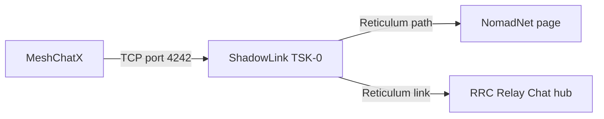

# Connecting to ShadowNode with MeshChatX

I wanted a simple way to show somebody that a Reticulum node is not just a configuration file and a terminal full of logs. Give the person a client, point it at a public node, and suddenly there is a page to browse and a chat hub to join.

That is what ShadowNode is for. The public node is called **ShadowLink TSK-0**, and it is running from São Paulo, Brazil. The easiest desktop client for this walkthrough is [MeshChatX](https://meshchatx.com/), an all-in-one Reticulum client with messaging, NomadNet browsing, Relay Chat, and an interface manager.

There is one detail that is easy to get wrong: [the ShadowNode status page](https://shadownode.teske.live/) is an ordinary HTTPS website that publishes the connection details. **MeshChatX does not connect to the HTTPS page.** It connects to the Reticulum TCP endpoint shown by that page, and then uses separate Reticulum destination hashes for the hosted applications.

So let's connect it properly.

## What we are actually connecting to

A Reticulum node can expose several destinations. They are not interchangeable URLs, even though they all belong to the same machine.

The status page is the source of truth because endpoints and destination hashes can change. The values below were present in the live status snapshot when I wrote this article:

| Purpose | Current value | Where it goes in MeshChatX |
|---|---|---|
| Public TCP uplink | `shadownode.teske.live:4242` | Interfaces |
| ShadowNode NomadNet page | `a3f0e7e7556e3d53a01d83c754f2acdd` | Nomad Network |
| ShadowNode Relay Chat hub | `c3fd74541dafc8b7077bc8a25a2c2302` | Relay Chat |
| NomadNet aspect | `nomadnetwork.node` | Nomad Network request |
| Relay Chat aspect | `rrc.hub` | Relay Chat hub settings |

The first value is a host and a TCP port. The next two values are 32-character Reticulum destination hashes. Do not paste the `https://shadownode.teske.live/` status-page URL into the interface host field, and do not use the NomadNet hash as the Relay Chat hash. They are different layers:



The status page also shows the node's transport telemetry and upstream peers. Those details are useful when debugging the node itself, but they are not required for the first client connection.

## Install MeshChatX

Open the [MeshChatX download page](https://meshchatx.com/download) and install the build for your platform. The project publishes desktop packages, an AppImage, Android builds, containers, and a Python package. Use the official download page rather than an old third-party package so the interface names match this article.

On Linux, the AppImage path is usually the least annoying one:

```bash
chmod +x ReticulumMeshChatX-*.AppImage
./ReticulumMeshChatX-*.AppImage
```

The exact filename includes the release version and architecture, so adjust the glob if it matches more than one file.

On first launch, MeshChatX asks you to create or select a local identity. That identity is part of Reticulum's cryptographic model and is stored locally; there is no ShadowNode account to create. Let the application finish starting before adding the interface.

## Add the ShadowNode uplink

This is the part where MeshChatX joins the Reticulum network. I am adding an outbound interface, not opening a server port on my own computer.

### Pick the interface type

MeshChatX exposes both the ordinary TCP client and the newer backbone interface:

| Platform | Interface type | Mode |
|---|---|---|
| Linux or Android | `Backbone` | Remote connection |
| Windows or macOS | `TCP Client` | Outbound connection |
| Any platform where Backbone is unavailable | `TCP Client` | Outbound connection |

Reticulum documents `BackboneInterface` as compatible with TCP client and server interfaces, but its current implementation is intended for Linux and Android. If you are on another platform, `TCP Client` is the boring and correct choice.

### Create the connection

MeshChatX's Interfaces page is where outbound Reticulum connections are managed:


*The Interfaces page with the ShadowLink connection enabled.*

1. Open **Interfaces** from the MeshChatX sidebar.
2. Choose **Add Interface**.
3. Give it a name such as `ShadowLink Interface`.
4. Select **Backbone** on Linux/Android, or **TCP Client** on Windows/macOS.
5. If you selected **Backbone**, keep **Listener mode** disabled. We are connecting to ShadowNode, not hosting a listener.
6. Enter the values below:

| Field | Value |
|---|---|
| Target host / Remote host | `shadownode.teske.live` |
| Target port | `4242` |
| KISS framing | Disabled |
| I2P tunneled | Disabled |
| Default bootstrap-only for new outbound TCP | Disabled for a permanent uplink |


*The TCP Client values used for ShadowNode.*

The host is deliberately just `shadownode.teske.live`. No scheme, no slash, no `https://`. This is a raw TCP interface, not a web request.

Leave an optional transport identity blank for this first connection. The status page publishes one for diagnostics, but a normal client does not need to pin it manually.

MeshChatX also shows **Default bootstrap-only for new outbound TCP**. I turn that off when ShadowNode is going to be my permanent uplink. Reticulum's bootstrap-only option is meant for a temporary bridge that can be detached after other automatically discovered interfaces take over. If you are using ShadowNode only to bootstrap a local mesh, leaving it enabled is reasonable; otherwise, disable it so the interface stays available.

Click **Create Connection**. Back on the Interfaces page, use the power button on the new card to **Enable** it. If MeshChatX displays a **Restart RNS** or restart-required banner, restart the Reticulum instance from that page. Configuration changes cannot do much while the old interface set is still running (a classic case of the UI being technically right and still appearing to do nothing).

The interface card should report that it is enabled and, after a moment, connected or online.

## Check that paths are appearing

An enabled TCP socket is not quite the same thing as a useful Reticulum path. Open **Tools → RNPath** and give the network a moment to populate its path table.

If the interface is connected but the path table stays empty:

- Open [the ShadowNode status page](https://shadownode.teske.live/) and check whether the public entry is operational.
- Confirm that the host is exactly `shadownode.teske.live` and the port is `4242`.
- Check local DNS and outbound firewall rules for TCP connections.
- Make sure you did not accidentally create a TCP server or Backbone listener instead of a client connection.
- If you changed the interface while MeshChatX was running, use **Restart RNS** and check again.

The strongest test is not the interface badge. It is reaching one of the applications hosted behind the node.

## Browse the ShadowNode NomadNet page

The ShadowNode page is a NomadNet application, so it uses the NomadNet destination hash rather than the TCP endpoint.

1. Open **Nomad Network** in MeshChatX.
2. Paste the current **NomadNet** destination from the ShadowNode status page. At the time of writing it is:

   ```text
   a3f0e7e7556e3d53a01d83c754f2acdd
   ```

3. Open the default page. MeshChatX normally requests `/page/index.mu` automatically. If the UI asks for a path, enter:

   ```text
   /page/index.mu
   ```

4. Wait for path discovery and the Reticulum link request to complete.

This is a nice diagnostic because it exercises the whole chain: MeshChatX's Reticulum interface, the route through ShadowNode, the `nomadnetwork.node` destination, and the page request itself. A browser loading the HTTPS status page proves none of those things; the NomadNet request does.

If it times out, go back to **Tools → RNPath** first. Repeating the request without a path is usually just making the same mistake faster.

## Join the ShadowNode Relay Chat hub

ShadowNode also publishes an RRC Relay Chat hub. MeshChatX hides Relay Chat when the feature is disabled, so enable it before looking for the hub.

The Relay Chat page is where hubs are added:


*The Relay Chat page with **Add a hub** and the connected ShadowLink TSK-0 hub.*

After clicking **Add a hub**, MeshChatX opens the destination form:


*Enter the current RRC hub destination hash in the Add a Relay Chat Hub dialog.*

1. Open **Settings**.
2. Under **Appearance**, enable **Relay Chat**. The setting is called `rrc_enabled` internally.
3. Open **Relay Chat** from the main navigation.
4. Click the **+** button or **Add Hub**.

5. Enter the current **Hub Destination Hash** from the status page. The current value is:

   ```text
   c3fd74541dafc8b7077bc8a25a2c2302
   ```

6. Give it a name such as `ShadowLink TSK-0`.
7. Open the advanced fields and use `rrc.hub` as the destination name if MeshChatX asks for one.
8. Click **Add Hub**, expand the new hub, and click **Connect**.
9. Expand **Available rooms** and refresh the list. To join the room used in this walkthrough, enter `teskeslab`, leave **Room key** blank, and click **+**.


*Enter `teskeslab` and click **+** to join the room.*

After joining `teskeslab`, the room opens under the connected ShadowLink hub:


*The connected `teskeslab` room in MeshChatX.*

Room availability is discovered from the hub rather than guaranteed by the status page. If the hub connects but `teskeslab` does not open, refresh **Available rooms** and try again later. A successful hub connection still proves that the Reticulum link is working.

## A small troubleshooting table

| Symptom | What it usually means | What to check |
|---|---|---|
| Interface never connects | Wrong transport settings or no TCP route | Use `shadownode.teske.live`, port `4242`, with no `https://` prefix |
| Interface is enabled but paths are empty | RNS has not restarted or the route is unavailable | Restart RNS, then inspect **Tools → RNPath** |
| NomadNet page times out | Wrong application hash or no path to it | Copy the current NomadNet hash from the status page |
| Relay Chat is not visible | The feature is disabled | **Settings → Appearance → Relay Chat** |
| Relay hub connects but has no rooms | No room is currently advertised | Refresh **Available rooms** and try again later |
| Interface disappears after another network is found | Bootstrap-only mode detached it | Edit the interface and disable **Default bootstrap-only for new outbound TCP** |
| Connection works on one network but not another | Egress filtering or DNS trouble | Test TCP 4242 reachability and check the current status page endpoint |

Do not confuse a status page outage with a Reticulum application outage. The HTTPS page and the RNS services are related, but they are different paths and different processes. The status page is still the first place to check because it publishes the live endpoint and destination hashes.

## What I ended up with

The final setup is pleasantly small:

- One outbound `BackboneInterface` or `TCPClientInterface` pointing at `shadownode.teske.live:4242`.
- A local MeshChatX identity stored on my device.
- The ShadowNode NomadNet destination saved in the Nomad browser.
- The ShadowNode RRC hub saved in Relay Chat.

No account, VPN, port forwarding, or separate Reticulum daemon is required for this client setup. MeshChatX runs the Reticulum stack locally, the TCP interface gets it onto the mesh, and the application destination hashes select the page or chat service after the route exists.

That separation is the bit that made the setup click for me: **the TCP endpoint gets you onto Reticulum, while the destination hash gets you to a specific application.** Once that is clear, connecting to another public node is just the same recipe with a different endpoint and different application hashes.

## Links

- [MeshChatX website](https://meshchatx.com/)
- [MeshChatX downloads](https://meshchatx.com/download)
- [MeshChatX source repository](https://github.com/Quad4-Software/MeshChatX)
- [MeshChatX interface documentation](https://github.com/Quad4-Software/MeshChatX/blob/master/docs/en/interfaces.md)
- [Reticulum interface manual](https://reticulum.network/manual/interfaces.html)
- [ShadowNode live status page](https://shadownode.teske.live/)

See you next time!
