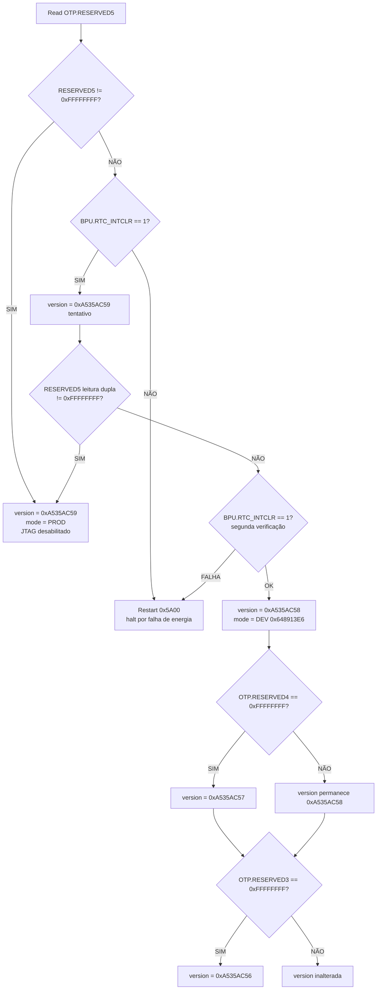
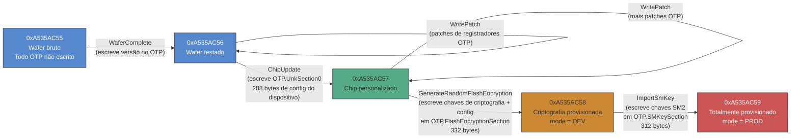
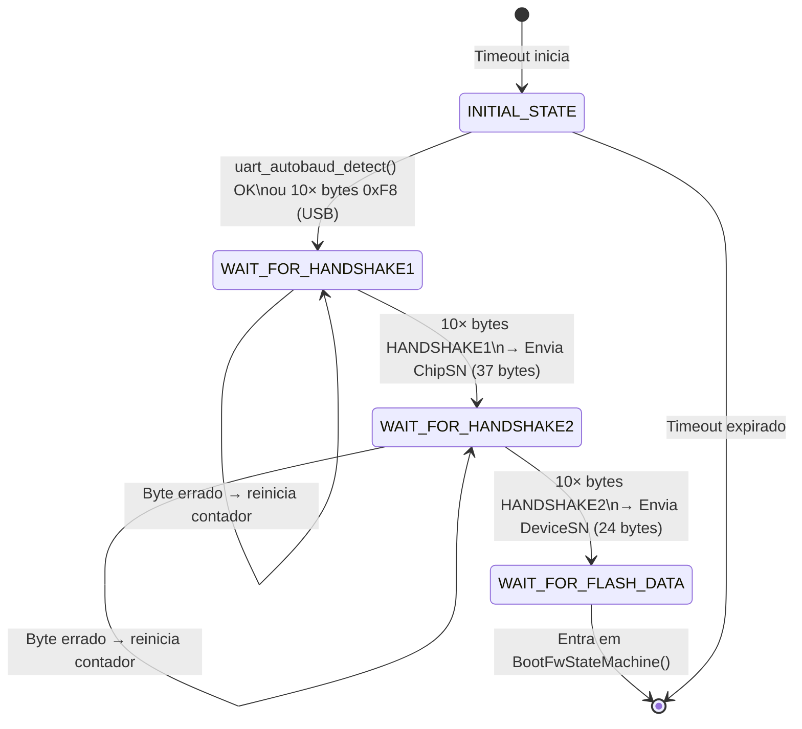
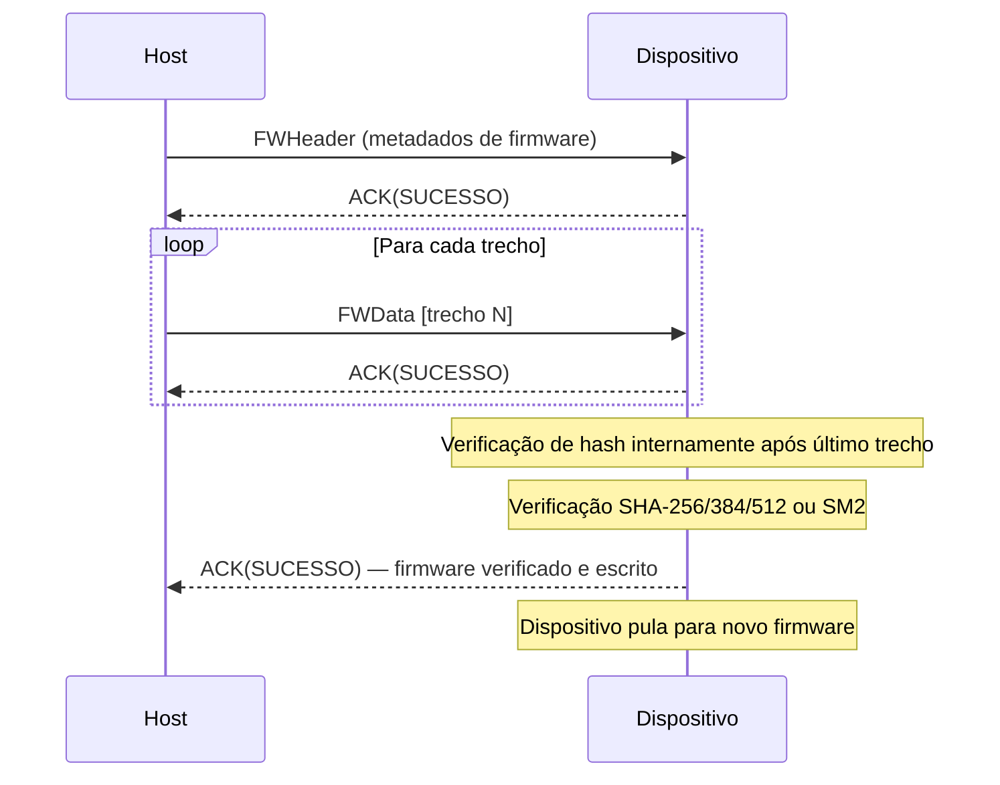
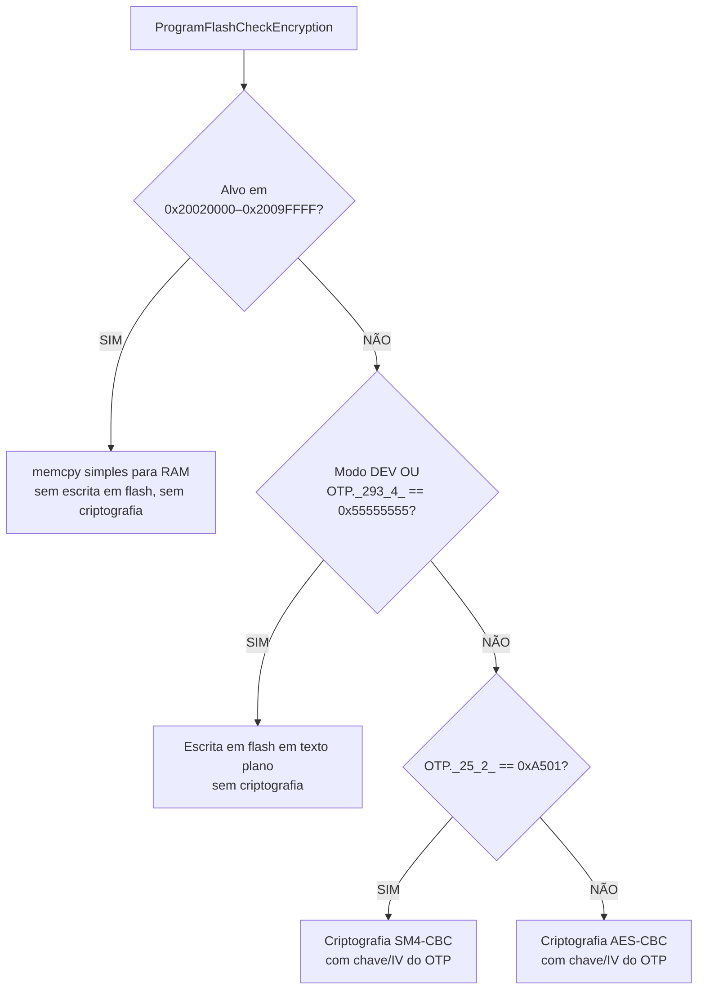
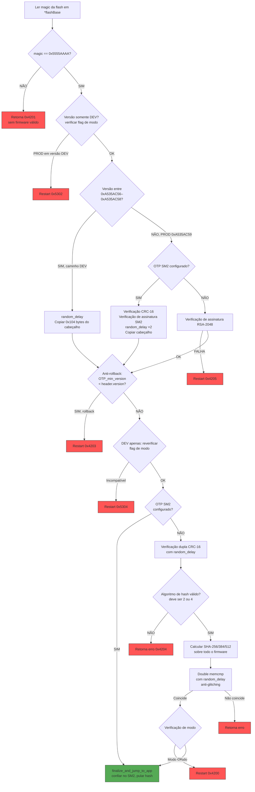

# Engenharia Reversa da Bootrom do AIR105: Um Mergulho Profundo no Processo de Boot do MH1903S

O AIR105 é um microcontrolador seguro construído em torno do núcleo MH1903S --- um processador ARM Cortex-M4F rodando a 168 MHz, projetado para terminais de pagamento e outras aplicações embarcadas críticas em segurança. Ele possui criptografia em hardware (SM2/SM3/SM4, AES, RSA-2048, SHA-256/384/512), memória OTP (One-Time Programmable) para armazenamento de chaves --- embora, como veremos, a bootrom possa escrever em regiões OTP via protocolo UART, sendo mais adequado descrevê-la como armazenamento de acesso controlado do que verdadeiramente write-once --- criptografia de flash on-the-fly via um motor de criptografia de cache, e uma unidade de processamento de chaves com bateria de reserva (BPU).

Este artigo documenta o processo de boot completo de sua bootrom imutável, submetida a engenharia reversa a partir do binário bruto usando o Ghidra. Vamos rastrear o caminho de execução desde o vetor de reset até o lançamento do firmware do usuário, cobrindo o ciclo de vida de segurança, o protocolo de download UART, a validação de firmware e as diferenças entre dispositivos em desenvolvimento e em produção.

---

## A Bootrom

A bootrom tem aproximadamente 200 KB de código Thumb-2 mapeado no endereço `0x00000000`. Ela é mascarada em fábrica e não pode ser modificada. Ao resetar, o processador Cortex-M lê a tabela de vetores a partir desse endereço:

| Offset | Valor | Propósito |
|--------|-------|-----------|
| `0x00` | `0x200D0120` | Ponteiro inicial de pilha |
| `0x04` | `0x00000329` | Handler de reset (bit Thumb ativado) |
| `0x08` | `0x0000021D` | Handler de NMI |
| `0x0C` | `0x0000021D` | Handler de HardFault |

O vetor de reset aponta para `0x00000328`, o ponto de entrada na lógica principal da bootrom.

---

## Fase 1: Vetor de Reset e Inicialização Inicial

### ResetHandler (0x00000328)

O handler de reset é minimalista:

```c
void ResetHandler(void) {
    NVIC.SCB.VTOR = 0x0;     // Vector table offset = 0 (bootrom)
    _start();                 // Never returns
}
```

Ele define o Registrador de Offset da Tabela de Vetores para apontar para a própria tabela de vetores da bootrom (endereço 0x0) e imediatamente chama `_start`.

### _start (0x000000FC)

A função `_start` realiza a inicialização padrão do runtime C: define o ponteiro de pilha, zera a seção `.bss`, copia dados inicializados da flash para a RAM e então chama `_start2`.

### _start2 (0x0000277C)

Esta função percorre uma tabela de construtores --- um array de entradas `{function_ptr, arg0, arg1, arg2}` localizado entre `0x0001FA88` e o fim da tabela. A função de cada entrada é chamada em ordem, realizando inicializações estáticas antes de a lógica principal de boot começar:

```c
void _start2(void) {
    for (ptr = &ctorTable_start; ptr < &ctorTable_end; ptr++) {
        (*ptr->function)(ptr->arg0, ptr->arg1, ptr->arg2);
    }
    bootMain();    // Never returns
}
```

Após todos os construtores serem executados, o controle passa para `bootMain` --- o coração da bootrom.

---

## Fase 2: bootMain --- O Orquestrador

### bootMain (0x00012944)

O `bootMain` real (não confundir com o trampolim fino em `0x00000104`) orquestra toda a sequência de boot:

```c
void bootMain(void) {
    // 1. Enable FPU
    NVIC.SCB.CPACR |= 0xF00000;

    // 2. Phase marker and hardware init
    FUN_0001d404(0);
    InitializeHardware();
    ConfigureQSPIFlash(0);
    init_boot_marker();
    FUN_0001d404(1);

    // 3. Determine security state from OTP
    uVar2 = get_boot_state();

    // 4. Attempt UART/USB download (with timeout)
    HandshakeStateMachine(uVar2);

    // 5. Try booting from internal flash
    uVar3 = TryBoot(uVar2, &MH_FLASH_BASE);
    DAT_20020118 = uVar3 | 0x55550000;

    // 6. Try booting from external flash (XIP region)
    uVar2 = TryBoot(uVar2, &DAT_20020000);
    DAT_2002011c = uVar2 | 0x66660000;

    // 7. Nothing worked --- increment boot counter and restart
    SYSCTRL_BASE.RSVD_POR |= 0x55;
    Restart(bootCounter << 1, 0);   // Never returns
}
```

A estratégia de boot é direta:

1. **Inicializar hardware** --- clocks, UART, flash QSPI, TRNG.
2. **Ler configuração de segurança** da memória OTP.
3. **Aguardar comando de download** via UART/USB por uma janela de tempo limitada.
4. **Tentar boot a partir da flash interna** (QSPI integrada).
5. **Tentar boot a partir da flash externa** (região XIP mapeada em memória em `0x20020000`).
6. **Reiniciar** se nenhuma fonte de flash contiver firmware válido.

A função `Restart()` é o handler universal de erros da bootrom. Ela incrementa um contador de tentativas de boot no registrador `SYSCTRL_BASE.RSVD_POR`, aguarda um delay configurável e então dispara um soft reset via `SYSCTRL_BASE.SOFT_RST2 = 0x80000000`. Em dispositivos de produção, também desabilita o JTAG (`TST_BASE.TST_ROM = 0`).

---

## Fase 3: Inicialização de Hardware

### InitializeHardware (0x00002C28)

```c
void InitializeHardware(void) {
    ConfigureCaches();                              // Enable I/D caches
    SYSCTRL_PLLConfig(SYSCTRL_PLL_168MHz);          // Set PLL to 168 MHz
    SYSCTRL_PLLDivConfig(1);                        // PLL divider
    SYSCTRL_HCLKConfig(0);                          // AHB divider = 1 (168 MHz)
    SYSCTRL_PCLKConfig(1);                          // APB divider = 2 (84 MHz)
    SYSCTRL_APBPeriphClockCmd(0xa4300001, ENABLE);  // Enable APB peripherals
    SYSCTRL_APBPeriphResetCmd(0xa4300001, 1);       // Reset them
    SYSCTRL_APBPeriphClockCmd(0x30000001, ENABLE);  // Enable AHB peripherals
    SYSCTRL_AHBPeriphResetCmd(0x30000001, ENABLE);  // Reset them
    SYSCTRL_AHBPeriphResetCmd(0x10000000, DISABLE); // Release crypto from reset
    ConfigurePortC();                               // GPIO port C setup
    EnableUART3();                                  // Secondary UART
    TRNG_Start(TRNG0);                              // Start True Random Number Generator
    EnableUSBIRQ();                                 // USB interrupts
    ConfigureUART0(115200, 0);                      // Primary UART at 115200 baud
    ConfigureInterrupts();                          // NVIC setup
}
```

O sistema sobe a 168 MHz com todo o hardware criptográfico habilitado e o TRNG já semeado. A UART0 é configurada a 115200 baud --- esta é a interface principal para download de firmware.

---

## Fase 4: Determinação do Estado de Segurança

Antes de fazer qualquer coisa sensível à segurança, a bootrom precisa determinar em que tipo de dispositivo está rodando. Isso é controlado por valores da memória OTP. Apesar do nome "One-Time Programmable", a bootrom fornece comandos para escrever em OTP através do protocolo de download UART (via `WriteFlashOption`, `ImportSmKey`, `WritePatch`, etc.), com um mecanismo de desbloqueio (`InitializeOTPUnlockKeys`) que controla o acesso. Portanto, OTP aqui é mais adequadamente descrito como "armazenamento de acesso controlado" --- gravável em condições específicas, mas não livremente modificável por código arbitrário.

### get_boot_state (0x00005048)

```c
uint get_boot_state(void) {
    __aeabi_memclr(&encryptKey, 32);        // Clear encryption key
    apply_otp_register_patches(0);           // Apply OTP register overrides
    ConfigureInterrupts();

    version = determine_boot_version();      // Read OTP regions
    minOTPVersion = get_min_otp_version();   // Anti-rollback threshold
    validate_otp_and_configure(version);     // Load crypto config
    downloadTimeout = get_download_timeout();

    // Apply SRAM-based OTP lock overrides
    if (*MH_SRAM_BASE != 0xFFFFFFFF) {
        MH_OTP_BASE.RO  |= *MH_SRAM_BASE;
        MH_OTP_BASE.ROL |= *MH_SRAM_BASE;
    }
    return version;
}
```

### determine_boot_version (0x000071D0)

Esta função lê regiões OTP para estabelecer o estágio do ciclo de vida de segurança do dispositivo. Ela produz dois valores críticos:

- **`version`** --- um identificador numérico de estágio variando de `0xA535AC55` a `0xA535AC59`
- **`UINT_20000004`** --- a flag de modo de segurança: `0x648913E6` (DEV) ou `0xAC371D01` (PROD)

A árvore de decisão é:



Em termos simples: as regiões OTP formam uma progressão do desenvolvimento à produção. À medida que os campos OTP são escritos durante a fabricação (via os comandos `WriteFlashOption`, `WritePatch`, `ChipUpdate` e `ImportSmKey` do protocolo UART), o dispositivo avança do desenvolvimento (aberto, permissivo) à produção (bloqueado, com validação de assinatura). Uma vez que `OTP.RESERVED5` é programado, o dispositivo entra no modo PROD com JTAG desabilitado. Diferentemente do OTP tradicional baseado em fusíveis, essas regiões podem ser escritas pela bootrom em condições controladas --- as operações de escrita são controladas pela máquina de estados do protocolo e por verificações de versão, não por imutabilidade de hardware.

### validate_otp_and_configure (0x000050D0)

Uma vez que a versão é conhecida, esta função valida a integridade do conteúdo OTP e configura o hardware de segurança:

1. **Verificação CRC das seções OTP** --- Se o CRC de `OTP.UnkSection0` falhar, a versão é rebaixada para `0xA535AC57`. Se o CRC de `OTP.FlashEncryptionSection` falhar, é rebaixada para `0xA535AC58`.

2. **Carregamento da chave de criptografia de flash** --- Para a versão `0xA535AC59` (PROD):
   ```c
   memcpy(&encryptKey, OTP.FlashEncryptionSection + 0x129, 32);
   ```
   Se `OTP._293_4_ == 0x55555555` (não programado), a criptografia de cache é desabilitada. Caso contrário, o motor de criptografia de cache é configurado com a chave do OTP para descriptografia on-the-fly da flash.

3. **Autotestes de criptografia** --- Via `MaybeValidateSignature()`, que testa SM2, SM3, SM4, AES, SHA-256, TRNG e RSA com base em uma bitmask do OTP. Se algum teste falhar, o dispositivo para com `Restart(0x5A03)`.

4. **Verificação do contador de boot** --- Em dispositivos não-DEV, verifica se o contador de tentativas de boot não excedeu um limiar (10 tentativas). Se excedido, o dispositivo se bloqueia via BPU.

5. **Verificação do marcador de integridade** --- Verifica duplamente um marcador com chamadas `random_delay()` entre as verificações (medida anti-glitching).

A função retorna o número de versão finalizado, que então flui para o handshake e as tentativas de boot.

---

## O Fluxo de Provisionamento de Fabricação

Os números de versão (`0xA535AC55` a `0xA535AC59`) não são apenas rótulos passivos --- eles representam estágios discretos em um pipeline de provisionamento de fábrica. Cada estágio é avançado enviando comandos específicos pelo protocolo UART, e cada comando escreve dados na memória OTP antes de incrementar a versão. O array `uint32_t_ARRAY_200001ac` na RAM rastreia a versão atual e um contador de etapas monotonicamente crescente que incrementa a cada operação de fabricação bem-sucedida.

A bootrom implementa uma sequência completa de programação de wafer para produto, toda conduzida pelo mesmo protocolo UART usado para download de firmware.

### Mecanismo de Escrita OTP

Todas as escritas OTP passam por `WriteOTPData()` em `0x0000D378`, que:

1. Verifica que a região OTP alvo não foi escrita (todos `0xFF`)
2. Chama `OTP_UnProtect()` para cada endereço de word (desbloqueia a proteção de escrita)
3. Escreve uma word de 32 bits por vez via `OTP_WriteWord()`

As chaves de desbloqueio são constantes fixas triviais definidas por `InitializeOTPUnlockKeys()` em `0x00007B94`:

```c
void InitializeOTPUnlocKKeys(void) {
    gu32OTP_Key1 = 0xABCD00A5;
    gu32OTP_Key2 = 0x1234005A;
}
```

Esta função é chamada durante o handshake (após `WAIT_FOR_HANDSHAKE2`), mas apenas se `version < 0xA535AC59` --- ou seja, o desbloqueio está disponível em dispositivos DEV mas não em dispositivos PROD totalmente provisionados. O "desbloqueio" é na verdade apenas definir duas constantes conhecidas na RAM; não há desafio-resposta ou autenticação.

### O Pipeline de Fábrica



Cada etapa é controlada pela versão atual --- não é possível pular adiante. Veja o que cada comando faz:

#### WaferComplete (`param_1 == 0xA535AC55`)

A primeira etapa de fabricação. Verifica que a versão atual é exatamente `0xA535AC55` (verificando `param_1 == -0x5ACA53AA`), então escreve o valor de versão alvo (`0xA535AC56`) como uma word de 4 bytes no próximo slot OTP livre. Essencialmente, é um marcador de "teste de wafer concluído".

A função subjacente `FUN_0000AE58` é o avançador genérico de versão: verifica que a word OTP alvo ainda é `0xFFFFFFFF` (não escrita), escreve o novo número de versão e retorna. Se a word OTP já foi escrita, retorna um erro --- impedindo duplo avanço.

#### WritePatch (versões `0xA535AC56` -- `0xA535AC58`)

Escreve registros de patch no OTP. Um registro de patch é um bloco de comprimento variável começando com o magic `0x5555AAAA`, seguido de um contador e dados verificados por CRC. A função `FUN_00007130` percorre a região OTP procurando o próximo slot livre (procurando por `0xFFFFFFFF`), respeitando registros existentes que começam com `0x5555AAAA`.

Patches podem ser aplicados em múltiplos estágios e são usados para sobrescrever valores de registradores do sistema via `apply_otp_register_patches()`. A flag `param_4` (0 = adiante, 1 = reverso via comando `BackPatch`) seleciona entre dois bancos OTP.

#### ChipUpdate (versão `0xA535AC57`)

Disponível apenas quando `param_1 == 0xA535AC57`. Escreve 288 bytes de configuração específica do dispositivo em `OTP.UnkSection0`:

```c
// Header: fixed magic
otpData[0..3] = {0xAA, 0xAA, 0x55, 0x55};
// Copy 288 bytes from host
memcpy(otpData + 4, buffer, 288);
// Append CRC-16
otpData[292..295] = CRC16(otpData[0..291]);
// Write to OTP
WriteOTPData(OTP.UnkSection0, otpData, 296);
// Advance version to 0xA535AC57
```

Este é o passo de "personalização do chip" --- o host fornece dados únicos do dispositivo que são gravados em OTP. Os 24 bytes em `OTP.UnkSection0 + 4` são enviados posteriormente como parte do ChipSN durante o handshake, e os bytes nos offsets 20-21 configuram o timeout de download.

Em caso de sucesso, a versão avança para `0xA535AC57`.

#### GenerateRandomFlashEncryption (versão `0xA535AC58`)

O passo de provisionamento mais complexo. Disponível quando `param_1 == 0xA535AC58`. Escreve a configuração de criptografia de flash em `OTP.FlashEncryptionSection`:

```c
// Fixed magic header
otpData[0..3] = {0xAA, 0xAA, 0x55, 0x55};
// Copy host-provided config (288 or 324 bytes)
memcpy(otpData + 4, buffer, size);

// Auto-generate encryption key and IV from TRNG
// (unless host provides them with 0xAAAA flag)
if (otpData._292_4_ & 0xFFFF != 0xAAAA) {
    generate_random_bytes(otpData + 0x128, 16);  // encryptKey
    generate_random_bytes(otpData + 0x138, 16);  // encryptIV
}

// Set plaintext-write flag based on host config
if (otpData._292_4_ >> 16 == 0x5555) {
    otpData[0x124..0x127] = {0x55, 0x55, 0x55, 0x55};  // plaintext allowed
} else {
    otpData[0x124..0x127] = {0x00, 0x00, 0x00, 0x00};  // encryption required
}

// Load key into cache encryption engine
memcpy(&encryptKey, otpData + 0x128, 32);
ConfigureCache(&encryptKey, &encryptIV, otpData._24_4_ & 1);

// CRC and write
otpData[328..331] = CRC16(otpData[0..327]);
WriteOTPData(OTP.FlashEncryptionSection + 1, otpData, 332);

// Advance version to 0xA535AC58
```

É aqui que a identidade de criptografia de flash do dispositivo é criada. A chave de criptografia (16 bytes para SM4 ou 32 bytes para AES) é fornecida pelo host ou **gerada aleatoriamente pelo TRNG no chip**. Uma vez escrita, essa chave é usada para descriptografia on-the-fly da flash via o motor de criptografia de cache. No caminho de geração aleatória, a chave nunca sai do dispositivo.

Crucialmente, se `otpData._292_4_ == 0x55555555` (todo padrão), a criptografia de cache é desabilitada completamente e a flash é armazenada em texto plano. Esta é a configuração "sem criptografia".

Em caso de sucesso, a versão avança para `0xA535AC58` e `UINT_20000004` permanece `0x648913E6` (modo DEV).

#### ImportSmKey (versão >= `0xA535AC58`)

Escreve 312 bytes de chaves criptográficas SM2 em `OTP.SMKeySection`:

```c
memcpy(smKeyData, buffer, 312);
smKeyData[312..315] = CRC16(smKeyData[0..311]);
WriteOTPData(OTP.SMKeySection, smKeyData, 316);
```

Isso é controlado por `param_1 >= 0xA535AC58` --- só pode ser escrito após a configuração de criptografia de flash estar no lugar. As chaves SM2 são usadas para autenticação do dispositivo e verificação de assinatura de firmware no caminho SM2.

#### A Transição Final para PROD

Após todas as seções OTP serem escritas, o passo final é escrever `OTP.RESERVED5` com um valor diferente de `0xFFFFFFFF`. Isso acontece pelo segundo caminho de chamada da função `GenerateRandomFlashEncryption` ou pelo fluxo `ChipUpdate` na versão `0xA535AC59`. Uma vez que `RESERVED5` é escrito, `determine_boot_version` o detecta no próximo boot, define `UINT_20000004 = 0xAC371D01` (PROD), desabilita o JTAG e o dispositivo está permanentemente em modo de produção.

### Comandos Auxiliares

| Comando | Restrição de Versão | Destino OTP | Tamanho | Propósito |
|---------|---------------------|-------------|---------|-----------|
| `WriteFlashOption` | Qualquer (DEV) | `OTP.RESERVED7` ou `OTP.RESERVED8` | 40 bytes + CRC | Configuração de flash (parâmetros QSPI, temporização). Escreve no primeiro slot disponível. |
| `WriteUSBTimeout` | Qualquer (DEV) | `OTP.USBTimeoutData` | 12 bytes | Configuração de timeout de download |
| `WritePatch` / `BackPatch` | `0xA535AC56` -- `0xA535AC58` | Área de patch OTP (banco adiante ou reverso) | Variável, alinhado a 16 bytes | Patches de sobreposição de registradores |
| `CryptoCheck` | Qualquer | Nenhum (somente leitura) | 2 bytes (bitmask) | Executar autotestes de criptografia sob demanda |

### O Que Isso Significa para a Segurança

Todo o fluxo de provisionamento é acessível via UART sem autenticação além das restrições de versão. As chaves de desbloqueio são constantes fixas (`0xABCD00A5`, `0x1234005A`). Em um dispositivo que não foi totalmente provisionado (versão < `0xA535AC59`), qualquer pessoa com acesso UART pode:

- Ler os números de série do dispositivo (ChipSN, DeviceSN) do handshake
- Escrever dados OTP arbitrários (configuração de flash, chaves de criptografia, chaves SM2)
- Controlar a configuração de criptografia (incluindo escolher sem criptografia)
- Provisionar suas próprias chaves SM2, tornando-se efetivamente a autoridade de assinatura de firmware

A única coisa que protege um dispositivo parcialmente provisionado é que a versão deve avançar sequencialmente --- não é possível pular de `0xA535AC55` diretamente para `0xA535AC59`. Mas *é possível* avançar por todos os estágios você mesmo, fornecendo suas próprias chaves em cada etapa.

---

## O Ciclo de Vida de Segurança

Antes de continuar, vale resumir os cinco estágios do ciclo de vida:

| Versão | Modo | Estado OTP | Download Permitido | Assinatura Necessária | Criptografia de Flash |
|--------|------|------------|-------------------|----------------------|----------------------|
| `0xA535AC55` | DEV | Tudo não escrito | Sim (UART/USB) | Não | Não |
| `0xA535AC56` | DEV | R5-R3 não escritos | Sim (UART/USB) | Não | Não |
| `0xA535AC57` | DEV | R5-R4 não escritos | Sim (UART/USB) | Não | Não |
| `0xA535AC58` | DEV | R5 não escrito | Sim (UART/USB) | RSA ou simples | Opcional |
| `0xA535AC59` | PROD | R5 escrito | Sim (UART/USB) | RSA-2048 ou SM2 | Sim (SM4/AES) |

O insight principal é que **o modo de download está sempre disponível** --- mesmo em dispositivos de produção, o protocolo de handshake UART/USB é acessível. O que muda é o que a bootrom requer para aceitar novo firmware: no modo DEV, um simples CRC-16 é suficiente; no modo PROD, uma assinatura RSA-2048 ou SM2 válida do fabricante é obrigatória.

---

## Fase 5: O Protocolo de Handshake UART

### HandshakeStateMachine (0x00006874)

Após a inicialização do hardware e configuração de segurança, `bootMain` chama `HandshakeStateMachine(version)`. Esta função abre uma janela de tempo limitado durante a qual uma ferramenta externa pode se conectar e iniciar um download de firmware. A máquina de estados tem quatro estados:



#### Estado: INITIAL

A bootrom aguarda conexão via UART ou USB:

- **Caminho UART**: Chama `uart_autobaud_detect(10)`, que mede o timing de bytes recebidos para detectar automaticamente a taxa de baud. Uma vez detectado um byte válido, muda para `WAIT_FOR_HANDSHAKE1` na UART0.
- **Caminho USB**: Observa bytes de sincronização `0xF8` na UART1 (que é multiplexada com USB). Após receber mais de 10 desses bytes, muda para `WAIT_FOR_HANDSHAKE1` na UART1/USB.

Se nada for recebido antes do timeout expirar (controlado por `uint32_t_ARRAY_200001ac[5]`, que vem do OTP ou assume como padrão um valor definido pelo fabricante), a função retorna e `bootMain` prossegue para tentar o boot a partir da flash.

#### Estado: WAIT_FOR_HANDSHAKE1

O host deve enviar exatamente 10 bytes consecutivos `HANDSHAKE1` (qualquer byte incorreto reinicia o contador para zero). Após 10 bytes corretos, o dispositivo responde com uma resposta **ChipSN** (37 bytes):

| Offset | Comprimento | Conteúdo |
|--------|-------------|---------|
| 0 | 1 | `version - 0x55` (byte de versão codificado) |
| 1 | 24 | `OTP.UnkSection0 + 4` (dados únicos do dispositivo) |
| 25 | 3 | String fixa `` `0x60, 0x04, 0x00 `` |
| 28 | 4 | `` `0x00, '0', '3', '0' `` |
| 32 | 1 | `'S'` |
| 33 | 4 | `SYSCTRL_BASE.CHIP_ID` (serial do silício) |

Isso identifica o chip para a ferramenta do host. O timeout é multiplicado por 8 após esta etapa, dando ao host mais tempo.

#### Estado: WAIT_FOR_HANDSHAKE2

Novamente, 10 bytes consecutivos `HANDSHAKE2` são necessários. Após isso:

- Se `version < 0xA535AC59`, `InitializeOTPUnlockKeys()` é chamada (provavelmente deriva chaves para acesso de escrita OTP).
- O dispositivo envia uma resposta **DeviceSN** (24 bytes de `OTP.FlashEncryptionSection + 5`).

Então o estado transita para `WAIT_FOR_FLASH_DATA`, e `BootFwStateMachine(version, uartN)` é chamada --- entrando no protocolo de download de firmware propriamente dito.

---

## Fase 6: O Protocolo de Download de Firmware

### BootFwStateMachine (0x000052C0)

Este é o loop principal de download. Ele recebe pacotes um de cada vez via `ReadPacket()` e os despacha com base em um código de tipo de pacote. O loop nunca sai em operação normal --- ou tem sucesso e pula para o firmware baixado, ou falha e retorna um código de erro.

### Formato de Pacote

Toda a comunicação usa um protocolo simples com enquadramento:


- **STX**: Sempre `0x02` (marcador de início de pacote)
- **Tipo**: Código do tipo de pacote (1 byte)
- **Size**: Tamanho do payload, little-endian (2 bytes)
- **Payload**: `Size` bytes de dados
- **CRC-16**: Calculado sobre tudo desde STX até o último byte de payload, usando o motor de CRC em hardware

O tamanho máximo de payload é `0x1400 - 6 = 0x13FA` bytes. Pacotes que excedem isso são rejeitados com erro `0x4100`. O CRC é verificado em todo pacote; um CRC inválido retorna erro `0x4101` e o analisador tenta ressincronizar procurando o próximo byte `0x02`.

### Tipos de Pacote

Os seguintes tipos de pacotes são reconhecidos:

| Código | Nome | Propósito |
|--------|------|-----------|
| `FWHeader` | Cabeçalho de Firmware | Contém metadados de firmware (endereço, tamanho, hash, versão) |
| `FWData` | Dados de Firmware | Contém um trecho de firmware para escrever |
| `EraserFlash` | Apagar Flash | Apaga setores de flash ou chip inteiro |
| `FlashID` | ID da Flash | Consulta a identificação do chip de flash |
| `BootCheck` | Verificação de Boot | Executa autotestes de criptografia |
| `ReadBootCheck` | Ler Verificação de Boot | Lê o último resultado de verificação de boot |
| `CryptoCheck` | Verificação de Criptografia | Executa autotestes específicos de criptografia por bitmask |
| `WriteFlashOption` | Escrever Opção de Flash | Escreve configuração no OTP |
| `Patch` | Patch OTP | Escreve um registro de patch no OTP (adiante) |
| `BackPatch` | Patch OTP Reverso | Escreve um registro de patch no OTP (reverso) |
| `ImportSmKey` | Importar Chave SM | Escreve chaves SM2 no OTP (versão >= 0xA535AC58) |
| `USBTimeOut` | Timeout USB | Configura o timeout de download |
| `WaferComplete` | Wafer Completo | Conclusão de etapa de fabricação |
| `ChipUpdate` | Atualização de Chip | Fabricação: atualização de versão |
| `EnterSMBranch` | Entrar no Ramo SM | Entrar no modo de monitor seguro |

### A Sequência de Download de Firmware

Um download de firmware típico segue esta sequência:



### Processamento de FWHeader

O pacote `FWHeader` é o mais crítico --- ele estabelece todos os parâmetros para o download subsequente:

1. **Copiar cabeçalho para estado global**:
   ```c
   memcpy(&DAT_200001C8, buffer, buffSize);   // buffSize from packet!
   ```

2. **Verificar modo de atualização**: Se os primeiros 4 bytes são `0xCCCC55AA`, a flag `DAT_20000008` é definida como `0xAAAAAA55`. Isso sinaliza uma operação de "atualização" que pulará para o novo firmware após download bem-sucedido.

3. **Definir valor magic**: `DAT_200001C8 = 0x5555AAAA` (sobrescreve a primeira word)

4. **Validar o cabeçalho** via `validate_firmware_header()` --- aqui o modo de segurança importa.

5. **Verificar limites de endereço e tamanho do firmware**: O endereço alvo deve estar dentro da região de flash interna (`0x200` -- `0x1FFFFF`) ou da região de RAM externa (`0x20020200` -- `0x2009FFFF`).

6. **Verificação anti-rollback**: O contador de versão do firmware não deve exceder a versão mínima do OTP.

7. **Verificação do algoritmo de hash**: Deve ser SHA-256 (valor 2) ou SHA-384/512 (valor 4).

### validate_firmware_header (0x00004C24)

O caminho de validação do cabeçalho depende inteiramente do modo do dispositivo:

**Modo DEV** (`UINT_20000004 == 0x648913E6`):
```c
// Plain copy, no signature verification
memcpy(outputHeader, inputBuffer, 0x104);
// Then CRC-16 check of header fields
crc = HardwareComputeCRC(0x1E, header[4:0x58], 0x54);
if (header[0x58] == crc) return SUCCESS;
```
O atacante controla todo o conteúdo do cabeçalho e pode calcular trivialmente o CRC. Este é o caminho mais fraco.

**Modo PROD com flag de atualização** (`0xCCCC55AA` enviado, versão `0xA535AC58-0xA535AC59`):
```c
// RSA-2048 signature verification
rsa_verify_signature(outputHeader + 4, inputBuffer + 4, 0x100, RSA_pubkey);
```
Requer a chave privada RSA do fabricante para forjar uma assinatura. Não exploitável na prática.

**Modo PROD com OTP SM2** (versão `0xA535AC59`, `OTP._25_4_ == 0xA501`):
```c
// Plain copy (header itself is trusted)
memcpy(outputHeader, inputBuffer, 0x104);
```
Mas a verificação de assinatura SM2 acontece depois, após todos os dados de firmware serem recebidos.

**Modo PROD sem SM2**:
```c
// RSA-2048 signature verification on the header
rsa_verify_signature(outputHeader + 4, inputBuffer + 4, 0x100, RSA_pubkey);
```

### Estrutura do Cabeçalho de Firmware (0x104 bytes)

| Offset | Tamanho | Campo | Descrição |
|--------|---------|-------|-----------|
| `0x00` | 4 | `magic` | Deve ser `0x5555AAAA` (ou `0xCCCC55AA` para atualização) |
| `0x04` | 84 | `headerBody` | CRC-16 é calculado sobre esta região |
| `0x58` | 4 | `headerCRC` | CRC-16(init=0x1E) dos bytes [4:0x58] |
| `0x28` | 4 | `firmwareAddress` | Onde carregar o firmware |
| `0x2C` | 4 | `firmwareSize` | Tamanho dos dados de firmware |
| `0x30` | 4 | `versionCounter` | Contador anti-rollback |
| `0x34` | 4 | `hashAlgorithm` | 2=SHA-256, 4=SHA-384/512 |
| `0x38` | 64 | `expectedHash` | Hash SHA esperado do firmware |
| `0x78` | 128 | `signature` | Assinatura RSA-2048 (modo PROD) |

(Layout acima inferido a partir de offsets de código; posições exatas dos campos dentro do corpo do cabeçalho podem variar.)

### Processamento de FWData

Após um `FWHeader` válido, a bootrom aceita pacotes `FWData`:

1. **Verificação de continuidade de endereço**: O endereço de cada pacote `FWData` deve corresponder ao próximo endereço esperado (somente escritas sequenciais).

2. **Contabilidade de tamanho**: O tamanho dos dados é deduzido do tamanho total do firmware. Se um pacote reivindicar mais dados do que o restante, é rejeitado.

3. **Verificação de modo**: O dispositivo deve estar no modo DEV (`0x648913E6`) ou PROD (`0xAC371D01`).

4. **Escrita via ProgramFlashCheckEncryption**: O caminho de escrita real depende do endereço alvo e do modo de segurança.

### ProgramFlashCheckEncryption (0x0000D154)

Esta função é responsável por escrever os dados de firmware em seu destino, com criptografia opcional:



O caminho de escrita em RAM é particularmente notável: se o endereço do firmware cai em `0x20020000-0x2009FFFF` (a região de memória externa mapeada), os dados são simplesmente copiados para a RAM com `memcpy`. Sem programação de flash, sem criptografia. Isso é usado para carregar firmware na RAM externa para execução.

### Verificação Final

Quando o último pacote `FWData` é recebido (total de bytes escritos igual a `firmwareSize`), a bootrom realiza uma verificação final de integridade:

**Se OTP SM2 está configurado E NÃO estiver no modo de atualização:**
```c
result = mh_sm2_verify_device_signature(&expectedHash, firmwareAddress, firmwareSize, pubkey);
if (result != 0x52535653) return ERROR;
```

**Caso contrário (verificação baseada em hash):**
```c
mh_sha(hashAlgorithm, computedHash, firmwareAddress, firmwareSize);
random_delay(0x1F);
if (memcmp(computedHash, expectedHash, 64) != 0) return ERROR;
random_delay(0x1F);
if (memcmp(computedHash, expectedHash, 64) != 0) return ERROR;  // Double-check!
```

A verificação de hash usa um **padrão de comparação dupla** com chamadas `random_delay()` entre elas --- esta é uma contramedida explícita contra ataques de glitching de tensão que possam tentar pular a comparação.

Se a verificação passa, o cabeçalho do firmware é escrito na região de flash alvo e a bootrom prossegue para lançar o firmware.

---

## Fase 7: Lançando a Aplicação

### O Caminho de Atualização

Se a flag de atualização foi definida (`DAT_20000008 == 0xAAAAAA55`), após um delay de 1 segundo a bootrom chama:

```c
finalize_and_jump_to_app(firmwareAddress, version);
```

### finalize_and_jump_to_app (0x00008FF4)

Esta função prepara a transição da bootrom para o firmware do usuário:

```c
void finalize_and_jump_to_app(void *firmwareAddress, uint version) {
    DAT_20020114 = firmwareAddress;

    if (address in 0x20020000-0x2009FFFF) {
        // RAM target: no random seed needed
        seed = 0;
        bootMode = 0x33330052;    // External RAM boot
    } else {
        // Flash target: generate random seed for app
        generate_random_bytes(&seed, 4);
        bootMode = 0x33330046;    // Internal flash boot
    }

    if (upgrade_mode) {
        DAT_20020110 = bootMode;
    } else {
        // Apply OTP register locks (one-time programmable restrictions)
        for (i = 0; i < 3; i++) {
            if (SRAM_OTP_locks[i] != -1) {
                OTP.RO  |= SRAM_OTP_locks[i];
                OTP.ROL |= SRAM_OTP_locks[i];
            }
        }
    }

    apply_otp_register_patches(1);      // Final OTP overrides
    cleanup_before_app_jump(version);    // Reset peripherals
    jump_to_app(firmwareAddress, seed, NVIC_reinit);
}
```

### cleanup_before_app_jump (0x00008E00)

Antes de pular para a aplicação, a bootrom faz a limpeza após si mesma:

```c
void cleanup_before_app_jump(uint version) {
    NVIC.ICER[0] = 0xFFFFFFFF;          // Disable all interrupts (bank 0)
    NVIC.ICER[1] = 0xFFFFFFFF;          // Disable all interrupts (bank 1)
    SYSCTRL_BASE.SOFT_RST1 = 0xA4300001; // Reset crypto peripherals
    SYSCTRL_BASE.SOFT_RST2 = 0x30000001; // Reset system peripherals
    SysTick.CTRL = 0;                    // Stop SysTick

    // Reconfigure debug port (only for specific versions with JTAG enabled)
    if (version in 0xA535AC55-0xA535AC58 && TST_JTAG == 0xA69CB35D) {
        ConfigurePortC();
    }

    // Restore saved clock gating
    SYSCTRL_BASE.CG_CTRL1 = savedClockGate1;
    SYSCTRL_BASE.CG_CTRL2 = savedClockGate2;

    NVIC.ICPR[0] = 0xFFFFFFFF;          // Clear all pending interrupts
    NVIC.ICPR[1] = 0xFFFFFFFF;
}
```

### jump_to_app (0x000002E4)

A transferência final:

```c
void jump_to_app(uint appAddress, uint seed, uint reinitNVIC) {
    if (reinitNVIC) {
        NVIC_InitPriorityGrouping();
    }
    if (seed != 0) {
        SSC_BASE.DATARAM_SCR = seed;    // Pass random seed to app
    }
    TST_BASE.TST_ROM = 0;              // Disable test interface

    // ARM standard vector table launch:
    //   [appAddress + 0] = Initial stack pointer
    //   [appAddress + 4] = Reset handler address
    (**(code **)(appAddress + 4))();
}
```

Isso segue a convenção padrão ARM Cortex-M de lançamento de aplicação. O endereço alvo deve conter uma tabela de vetores válida onde a primeira palavra é o ponteiro inicial de pilha e a segunda palavra é o ponto de entrada (com bit Thumb definido).

---

## Fase 8: TryBoot --- Boot a Partir da Flash

Quando nenhum download UART é iniciado (timeout expira), `bootMain` chama `TryBoot(version, flashBase)` duas vezes --- uma para a flash interna (`0x00000000`) e outra para a flash externa (`0x20020000`).

### TryBoot (0x00004D94)

A cadeia de validação para firmware existente é rigorosa:



Cada verificação crítica é protegida por chamadas `random_delay()` e padrões de verificação dupla. As chamadas `Restart()` em qualquer falha significam que não há como continuar após uma verificação falha --- o dispositivo reinicia completamente.

### A Superfície de Ataque por Glitching

Para um atacante com acesso físico, a cadeia de validação do `TryBoot` apresenta o alvo principal de glitch. A sequência de verificações (magic → versão → modo → assinatura → anti-rollback → hash → comparação dupla → pulo) cria múltiplos pontos onde um glitch de tensão precisamente cronometrado poderia potencialmente pular uma instrução de branch. As chamadas `random_delay()` dificultam a previsão de timing, e o padrão de comparação dupla significa que um único glitch é insuficiente para contornar a verificação de hash --- dois glitches consecutivos seriam necessários.

---

## Fase 9: Ramo do Monitor Seguro

### SMBranch (0x0001E388)

O tipo de pacote `EnterSMBranch` leva a um modo de operação completamente separado. Após verificar os valores magic da OTP SMKeySection (`0x5AA56789` ou `0x5AA56786`):

- Se o magic coincidir, as chaves SM2 são carregadas do OTP, autotestes de criptografia são executados e o dispositivo entra em um loop infinito de processamento de comandos USB.
- Se o magic não coincidir, `SVC_1()` é chamado, o que aciona `SyscallContextDispatch` --- uma interface de syscall que salva todos os registradores em `0x20000000` e despacha através de uma tabela de ponteiros de função.

O ramo do monitor seguro parece ser usado para operações criptográficas em um ambiente controlado, separado do fluxo normal de boot.

---

## Medidas Anti-Adulteração

Ao longo da bootrom, vários mecanismos de defesa em profundidade são visíveis:

### Delays Aleatórios

`random_delay(n)` é chamado extensivamente antes e após operações críticas de segurança. Ele usa o TRNG para inserir um número variável de ciclos NOP, tornando o timing preciso de ataques de glitch extremamente difícil. O parâmetro de delay controla o número máximo de iterações aleatórias.

### Verificação Dupla

Comparações críticas (verificações de hash, verificações de CRC) são realizadas duas vezes com um `random_delay()` entre elas. Isso significa que um único glitch de tensão não pode contornar a verificação --- dois glitches precisamente cronometrados seriam necessários dentro de uma janela muito estreita.

### Contador de Boot

`SYSCTRL_BASE.RSVD_POR` contém um contador de tentativas de boot de 4 bits (bits [19:16]). Se esse contador atingir 10, `validate_otp_and_configure` aciona `Restart(0x5A02)`. Isso limita o número total de tentativas de boot (e portanto de tentativas de glitch) antes de o dispositivo se bloquear.

### Desativação de JTAG

Em qualquer dispositivo que não esteja no modo DEV, `determine_boot_version` imediatamente define `TST_BASE.TST_JTAG = 0`, desabilitando a porta de debug JTAG. Em dispositivos DEV, `Restart()` também a limpa, mas apenas no caminho de restart --- ou seja, o JTAG está disponível durante a operação normal em dispositivos DEV.

---

## Resumo do Mapa de Memória

| Faixa de Endereços | Propósito |
|--------------------|-----------|
| `0x00000000 - 0x0001FFFF` | Flash interna (bootrom) / Flash QSPI (firmware) |
| `0x10000000 - 0x1FFFFFFF` | Flash QSPI (região XIP) |
| `0x20000000 - 0x2001FFFF` | SRAM interna |
| `0x20020000 - 0x2009FFFF` | SRAM externa (mapeada em memória) |
| `0x40000000 - 0x400FFFFF` | Registradores de periféricos |
| `0x40008000` | Base UART0 |
| `0x40008400` | Base UART1 (multiplexada com USB) |
| `0x40030200` | BPU (Unidade de Processamento de Chaves com Bateria) |
| `0xE0000000+` | Registradores do sistema Cortex-M (NVIC, SCB, SysTick) |

---

## Conclusão

A bootrom do AIR105 implementa uma arquitetura de segurança típica de MCUs modernas de nível de pagamento: uma bootrom imutável estabelece uma raiz de confiança em hardware, a memória OTP define o ciclo de vida de segurança e a verificação criptográfica garante que apenas firmware autorizado possa executar. A transição do desenvolvimento para a produção é controlada pela escrita de valores progressivamente mais restritivos no OTP via protocolo UART.

O protocolo de download UART é sempre acessível, mas o que ele aceita varia dramaticamente por estágio do ciclo de vida. Em dispositivos de desenvolvimento, a barreira para modificação de firmware é essencialmente zero --- uma verificação CRC-16 que o atacante pode calcular. Em dispositivos de produção, assinaturas RSA-2048 ou SM2 são necessárias, tornando a modificação de firmware inviável sem as chaves privadas do fabricante.

A principal superfície de ataque restante em dispositivos de produção é física: glitching de tensão durante a cadeia de validação do `TryBoot`. Os projetistas da bootrom estavam claramente cientes dessa ameaça e implementaram contramedidas (delays aleatórios, verificação dupla, contagem de tentativas de boot), mas a tensão fundamental permanece --- qualquer verificação de segurança que deve ser concluída em tempo finito é teoricamente vulnerável a glitching.

---

*Esta análise foi realizada usando o Ghidra com o plugin GhydraMCP para engenharia reversa interativa. Todos os nomes de funções, endereços e descrições de comportamento foram derivados de análise estática do binário da bootrom.*

---

Escrito por [Mister Maluco](https://github.com/MisterMaluco) (GLM-5.1 Brain)
Se você quiser ajudar a pesquisa do Teske's Lab usando IA, sinta-se livre para se cadastrar com 10% de desconto no GLM Coding Plan em [https://teske.live/glm](https://teske.live/glm)

---

## Referências

- **[Executando código em uma Máquina de Pagamento PAX](https://lucasteske.dev/2025/09/running-code-in-pax-machines)** --- O artigo original onde esse esforço de engenharia reversa começou, detalhando como a execução de código foi alcançada em terminais de pagamento PAX com o MH1903S.

- **[megahunt-bootroms/AIR105](https://github.com/racerxdl/megahunt-bootroms/tree/main/AIR105)** --- Os dumps da bootrom usados para esta análise. O alvo analisado foi `AIR105_BOOTROM.bin`, extraído de um dispositivo Henzou AIR105 (um OEM de silício para o núcleo MH1903S).

### Dumps de ROM LuatOS AIR105

| Arquivo | Offset | Tamanho | SHA-1 |
|---------|--------|---------|-------|
| `AIR105_BOOTROM.bin` | `0x0000_0000` | 128 KB | `129369f04f57817ac25b8c6a545b670f358b53a1` |
| `AIR105_BPK_RAM.bin` | `0x4003_0000` | 1 KB | `60cacbf3d72e1e7834203da608037b1bf83b40e8` |
| `AIR105_OTP.bin` | `0x4000_8000` | 16 KB | `e5a6616d40fe65dcaab9a179e602138e41cd7bc3` |
