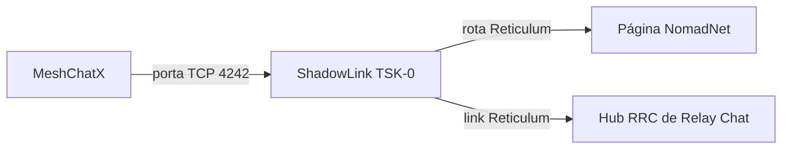

# Conectando ao ShadowNode com o MeshChatX

Eu queria uma forma simples de mostrar para alguém que um nó Reticulum não é apenas um arquivo de configuração e um terminal cheio de logs. Dê um cliente para a pessoa, aponte-o para um nó público e, de repente, existe uma página para navegar e um hub de chat para acessar.

É para isso que serve o ShadowNode. O nó público se chama **ShadowLink TSK-0** e está operando a partir de São Paulo, Brasil. O cliente desktop mais fácil para este passo a passo é o [MeshChatX](https://meshchatx.com/), um cliente Reticulum completo com mensagens, navegação NomadNet, Relay Chat e gerenciamento de interfaces.

Existe um detalhe fácil de confundir: [a página de status do ShadowNode](https://shadownode.teske.live/) é um site HTTPS comum que publica os dados de conexão. **O MeshChatX não se conecta à página HTTPS.** Ele se conecta ao endpoint TCP da rede Reticulum mostrado nessa página e depois usa hashes de destino Reticulum diferentes para os aplicativos hospedados.

Então vamos fazer a conexão do jeito certo.

## Ao que realmente estamos nos conectando

Um nó Reticulum pode expor vários destinos. Eles não são URLs intercambiáveis, mesmo quando todos pertencem à mesma máquina.

A página de status é a principal referência porque endpoints e hashes de destino podem mudar. Os valores abaixo estavam presentes no status ao vivo quando escrevi este artigo:

| Finalidade | Valor atual | Onde usar no MeshChatX |
|---|---|---|
| Uplink TCP público | `shadownode.teske.live:4242` | Interfaces |
| Página NomadNet do ShadowNode | `a3f0e7e7556e3d53a01d83c754f2acdd` | Nomad Network |
| Hub de Relay Chat do ShadowNode | `c3fd74541dafc8b7077bc8a25a2c2302` | Relay Chat |
| Aspecto do NomadNet | `nomadnetwork.node` | Requisição do Nomad Network |
| Aspecto do Relay Chat | `rrc.hub` | Configuração do hub de Relay Chat |

O primeiro valor é um host e uma porta TCP. Os dois seguintes são hashes de destino Reticulum com 32 caracteres. Não cole a URL da página de status, `https://shadownode.teske.live/`, no campo de host da interface e não use o hash do NomadNet como hash do Relay Chat. Eles pertencem a camadas diferentes:



A página de status também mostra a telemetria de transporte do nó e os peers upstream. Esses detalhes são úteis para depurar o próprio nó, mas não são necessários para a primeira conexão do cliente.

## Instalando o MeshChatX

Abra a [página de downloads do MeshChatX](https://meshchatx.com/download) e instale a versão para sua plataforma. O projeto oferece pacotes desktop, AppImage, builds para Android, containers e um pacote Python. Use a página oficial em vez de um pacote antigo de terceiros para que os nomes das interfaces correspondam aos deste artigo.

No Linux, usar o AppImage costuma ser o caminho menos trabalhoso:

```bash
chmod +x ReticulumMeshChatX-*.AppImage
./ReticulumMeshChatX-*.AppImage
```

O nome exato do arquivo inclui a versão e a arquitetura. Ajuste o padrão caso ele encontre mais de um arquivo.

Na primeira execução, o MeshChatX pede para criar ou selecionar uma identidade local. Essa identidade faz parte do modelo criptográfico do Reticulum e fica armazenada localmente; não existe uma conta do ShadowNode para criar. Espere o aplicativo terminar de iniciar antes de adicionar a interface.

## Adicionando o uplink do ShadowNode

É aqui que o MeshChatX entra na rede Reticulum. Vamos adicionar uma interface de saída, e não abrir uma porta de servidor no próprio computador.

### Escolhendo o tipo de interface

O MeshChatX oferece tanto o cliente TCP comum quanto a interface Backbone mais recente:

| Plataforma | Tipo de interface | Modo |
|---|---|---|
| Linux ou Android | `Backbone` | Conexão remota |
| Windows ou macOS | `TCP Client` | Conexão de saída |
| Qualquer plataforma sem suporte a Backbone | `TCP Client` | Conexão de saída |

A documentação do Reticulum descreve a `BackboneInterface` como compatível com interfaces TCP cliente e servidor, mas sua implementação atual é voltada para Linux e Android. Em outra plataforma, `TCP Client` é a opção simples e correta.

### Criando a conexão

É na página **Interfaces** do MeshChatX que as conexões Reticulum de saída são gerenciadas:


*A página **Interfaces** com a conexão ShadowLink habilitada.*

1. Abra **Interfaces** na barra lateral do MeshChatX.
2. Clique em **Add Interface**.
3. Dê um nome, como `ShadowLink Interface`.
4. Selecione **Backbone** no Linux ou Android, ou **TCP Client** no Windows ou macOS.
5. Se escolheu **Backbone**, mantenha **Listener mode** desabilitado. Queremos nos conectar ao ShadowNode, e não hospedar um listener.
6. Preencha os valores abaixo:

| Campo | Valor |
|---|---|
| Target host / Remote host | `shadownode.teske.live` |
| Target port | `4242` |
| KISS framing | Desabilitado |
| I2P tunneled | Desabilitado |
| Default bootstrap-only for new outbound TCP | Desabilitado para um uplink permanente |


*Os valores do **TCP Client** usados para o ShadowNode.*

O host é apenas `shadownode.teske.live`, de propósito. Sem esquema, sem barra e sem `https://`. Esta é uma interface TCP bruta, não uma requisição web.

Deixe a identidade de transporte opcional em branco nesta primeira conexão. A página de status publica uma para diagnóstico, mas um cliente comum não precisa fixá-la manualmente.

O MeshChatX também mostra **Default bootstrap-only for new outbound TCP**. Eu desabilito essa opção quando pretendo usar o ShadowNode como uplink permanente. A opção bootstrap-only do Reticulum serve para uma ponte temporária, que pode ser desconectada depois que outras interfaces descobertas automaticamente assumirem a conexão. Se você estiver usando o ShadowNode apenas para iniciar uma malha local, mantê-la habilitada é razoável; caso contrário, desabilite-a para que a interface continue disponível.

Clique em **Create Connection**. De volta à página **Interfaces**, use o botão de energia no novo card para **Enable** a interface. Se o MeshChatX exibir **Restart RNS** ou um aviso de reinicialização necessária, reinicie a instância do Reticulum por essa página. Alterações de configuração não fazem muita coisa enquanto o conjunto antigo de interfaces continua em execução — um caso clássico de a interface estar tecnicamente certa e, ainda assim, parecer que não fez nada.

O card da interface deve indicar que ela está habilitada e, depois de alguns instantes, conectada ou online.

## Verificando se as rotas estão aparecendo

Um socket TCP habilitado não é exatamente a mesma coisa que uma rota Reticulum útil. Abra **Tools → RNPath** e aguarde um pouco para a tabela de rotas ser preenchida.

Se a interface estiver conectada, mas a tabela continuar vazia:

- Abra [a página de status do ShadowNode](https://shadownode.teske.live/) e verifique se a entrada pública está operacional.
- Confirme que o host é exatamente `shadownode.teske.live` e a porta é `4242`.
- Verifique o DNS local e as regras do firewall para conexões TCP de saída.
- Confirme que você não criou por engano um servidor TCP ou um listener Backbone em vez de uma conexão cliente.
- Se alterou a interface enquanto o MeshChatX estava em execução, use **Restart RNS** e verifique novamente.

O teste mais confiável não é o indicador da interface, mas conseguir acessar um dos aplicativos hospedados atrás do nó.

## Navegando pela página NomadNet do ShadowNode

A página do ShadowNode é um aplicativo NomadNet. Por isso, ela usa o hash de destino NomadNet em vez do endpoint TCP.

1. Abra **Nomad Network** no MeshChatX.
2. Cole o destino **NomadNet** atual publicado na página de status do ShadowNode. No momento da escrita, ele é:

   ```text
   a3f0e7e7556e3d53a01d83c754f2acdd
   ```

3. Abra a página padrão. O MeshChatX normalmente solicita `/page/index.mu` automaticamente. Se a interface pedir um caminho, informe:

   ```text
   /page/index.mu
   ```

4. Aguarde a descoberta da rota e a conclusão da requisição do link Reticulum.

Esse é um bom diagnóstico porque exercita a cadeia inteira: a interface Reticulum do MeshChatX, a rota pelo ShadowNode, o destino `nomadnetwork.node` e a requisição da página. Carregar a página HTTPS de status em um navegador não comprova nenhuma dessas etapas; a requisição NomadNet comprova.

Se a requisição expirar, volte primeiro para **Tools → RNPath**. Repetir a solicitação sem uma rota normalmente é apenas cometer o mesmo erro mais rápido.

## Entrando no hub de Relay Chat do ShadowNode

O ShadowNode também publica um hub RRC de Relay Chat. O MeshChatX oculta o Relay Chat quando o recurso está desabilitado, então habilite-o antes de procurar o hub.

É na página **Relay Chat** que os hubs são adicionados:


*A página **Relay Chat** com **Add a hub** e o hub ShadowLink TSK-0 conectado.*

Ao clicar em **Add a hub**, o MeshChatX abre o formulário de destino:


*Informe o hash atual do destino RRC na janela **Add a Relay Chat Hub**.*

1. Abra **Settings**.
2. Em **Appearance**, habilite **Relay Chat**. Internamente, essa opção se chama `rrc_enabled`.
3. Abra **Relay Chat** na navegação principal.
4. Clique no botão **+** ou em **Add Hub**.
5. Informe o **Hub Destination Hash** atual publicado na página de status. O valor atual é:

   ```text
   c3fd74541dafc8b7077bc8a25a2c2302
   ```

6. Dê um nome, como `ShadowLink TSK-0`.
7. Abra os campos avançados e use `rrc.hub` como nome do destino, caso o MeshChatX solicite um.
8. Clique em **Add Hub**, expanda o novo hub e clique em **Connect**.
9. Expanda **Available rooms** e atualize a lista. Para entrar na sala usada neste passo a passo, digite `teskeslab`, deixe **Room key** em branco e clique em **+**.


*Digite `teskeslab` e clique em **+** para entrar na sala.*

Depois de entrar em `teskeslab`, a sala é aberta sob o hub ShadowLink conectado:


*A sala `teskeslab` conectada no MeshChatX.*

A lista de salas vem do hub e não é garantida pela página de status. Se o hub conectar, mas `teskeslab` não abrir, atualize **Available rooms** e tente novamente mais tarde. Uma conexão bem-sucedida com o hub ainda comprova que o link Reticulum está funcionando.

## Uma pequena tabela de solução de problemas

| Sintoma | O que normalmente significa | O que verificar |
|---|---|---|
| A interface nunca conecta | Configuração de transporte incorreta ou ausência de rota TCP | Use `shadownode.teske.live`, porta `4242`, sem o prefixo `https://` |
| A interface está habilitada, mas não há rotas | O RNS não foi reiniciado ou a rota está indisponível | Reinicie o RNS e confira **Tools → RNPath** |
| A página NomadNet expira | Hash de aplicativo incorreto ou ausência de rota | Copie o hash NomadNet atual da página de status |
| O Relay Chat não aparece | O recurso está desabilitado | **Settings → Appearance → Relay Chat** |
| O hub conecta, mas não há salas | Nenhuma sala está sendo anunciada | Atualize **Available rooms** e tente novamente mais tarde |
| A interface desaparece depois que outra rede é encontrada | O modo bootstrap-only a desconectou | Edite a interface e desabilite **Default bootstrap-only for new outbound TCP** |
| Funciona em uma rede, mas não em outra | Filtragem de saída ou problema de DNS | Teste o acesso TCP à porta 4242 e confira o endpoint atual na página de status |

Não confunda uma indisponibilidade da página de status com uma indisponibilidade dos aplicativos Reticulum. A página HTTPS e os serviços RNS estão relacionados, mas usam caminhos e processos diferentes. A página de status ainda é o primeiro lugar a verificar porque publica o endpoint e os hashes de destino atuais.

## O resultado final

A configuração final é agradavelmente pequena:

- Uma `BackboneInterface` ou `TCPClientInterface` de saída apontando para `shadownode.teske.live:4242`.
- Uma identidade local do MeshChatX armazenada no dispositivo.
- O destino NomadNet do ShadowNode salvo no navegador Nomad.
- O hub RRC do ShadowNode salvo no Relay Chat.

Não é necessário criar conta, configurar VPN, encaminhar portas ou executar um daemon Reticulum separado para este cliente. O MeshChatX executa a stack Reticulum localmente, a interface TCP coloca o cliente na malha e os hashes de destino dos aplicativos selecionam a página ou o serviço de chat depois que a rota existe.

Foi essa separação que fez a configuração finalmente ficar clara para mim: **o endpoint TCP coloca você no Reticulum, enquanto o hash de destino leva você a um aplicativo específico.** Depois de entender isso, conectar-se a outro nó público é apenas repetir a mesma receita com outro endpoint e outros hashes de aplicativo.

## Links

- [Site do MeshChatX](https://meshchatx.com/)
- [Downloads do MeshChatX](https://meshchatx.com/download)
- [Repositório de código do MeshChatX](https://github.com/Quad4-Software/MeshChatX)
- [Documentação de interfaces do MeshChatX](https://github.com/Quad4-Software/MeshChatX/blob/master/docs/en/interfaces.md)
- [Manual de interfaces do Reticulum](https://reticulum.network/manual/interfaces.html)
- [Página de status ao vivo do ShadowNode](https://shadownode.teske.live/)

Até a próxima!
